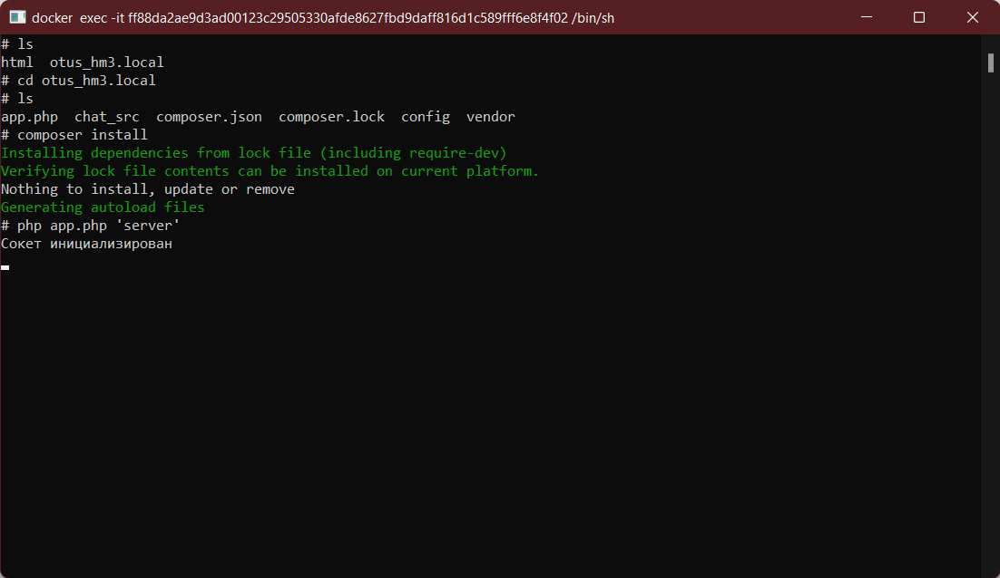
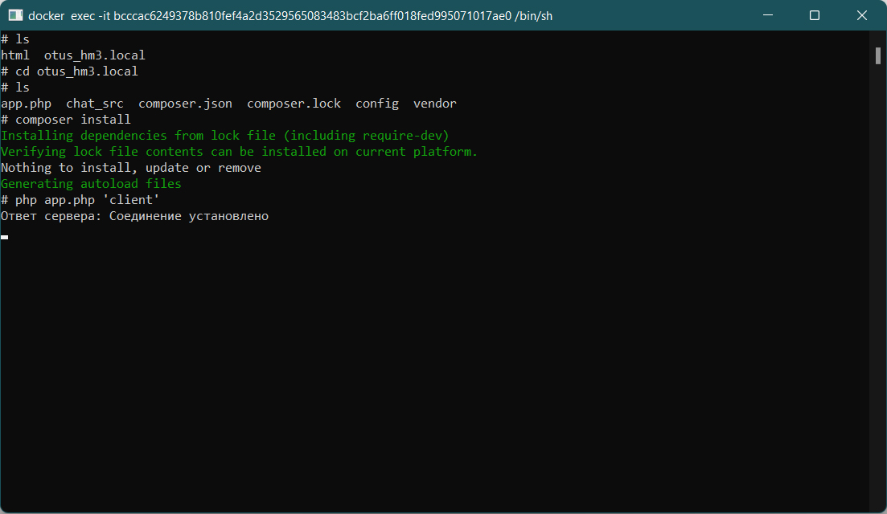
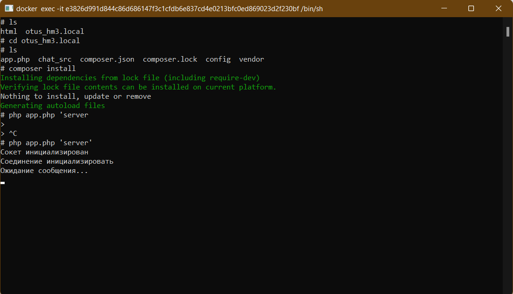
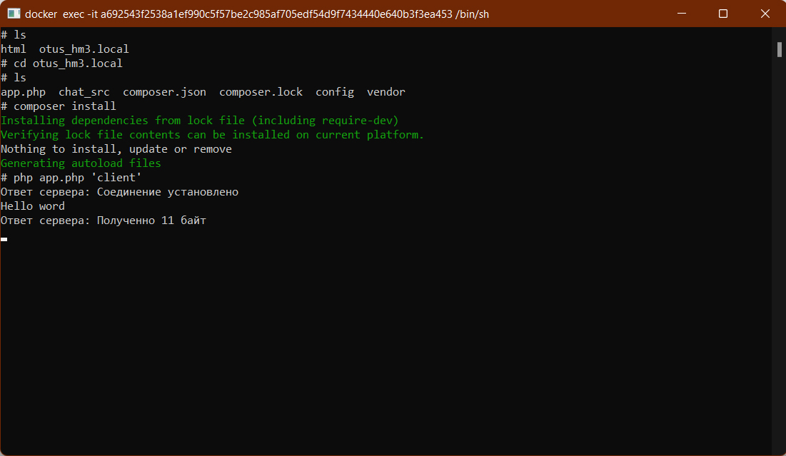
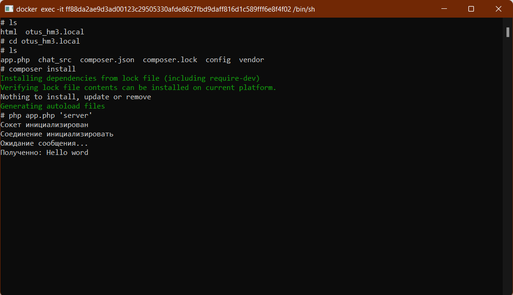

# Домашняя работа №3 - Внутреннее устройство PHP

## Выполнил: Мелёшкин В.В.

### Как запустить:

1. Создаём контейнеры командой:
    ```
    docker-compose up
    ```

2. В CLI контенера chat-server, нужно зайти в директорию
otus_hm3.local и в ней запустить скрипт app.php передав ему
строку 'server' в качестве аргумента:
    ```
    php app.php 'server'
    ```
    После чего появится сообщение об успешной инициализации сокета:
    
3. В CLI контейнера chat-client, нужно точно так же как и в 
шаге 2 запустить скрипт, но в качестве аргумента нужно уже
передать строку 'client':
    ```
    php app.php
    ```
    После этого появится сообщение о том что соединение с
    сервером успешно установлено:
    
    Контейнер выполняющий роль сервера, так же сообщит Вам
    что соединение успешно установлено:
    
    Теперь из контейнера клиента Вы можете отправить сообщение
    серверу и в ответ получить уведомление что данные полученны:
    
    Сервер так же сообщит Вам что получил данные от клиента и 
    выведет текст сообщения:
    
