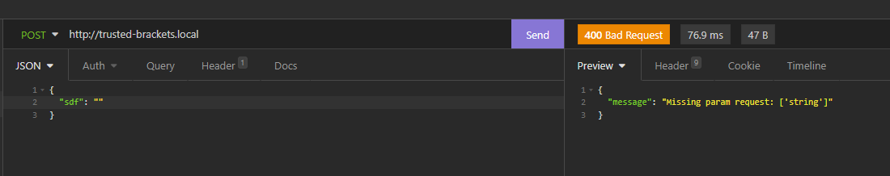
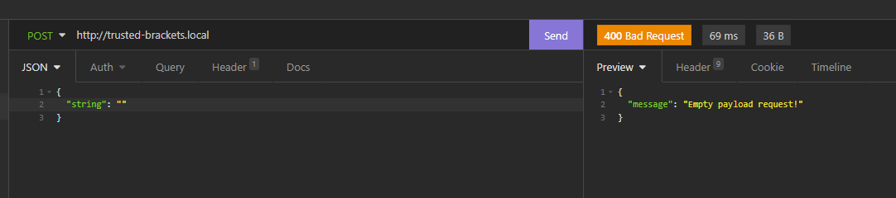
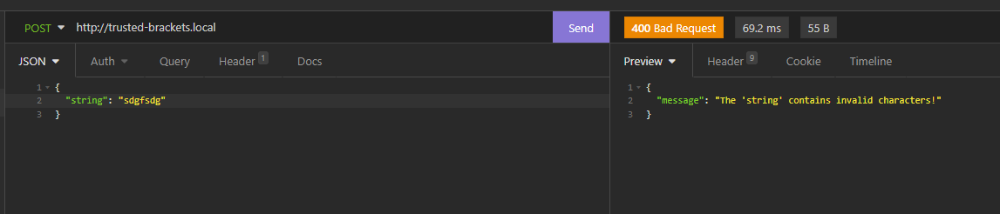
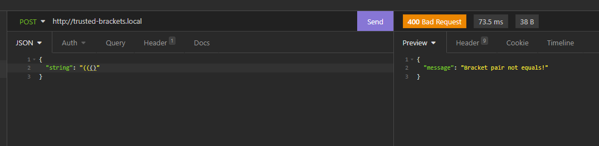
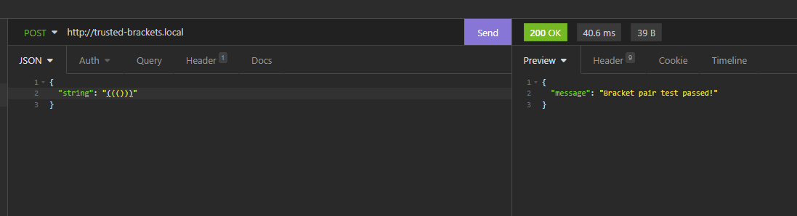

# PHP2021

https://otus.ru/lessons/razrabotchik-php/?utm_source=github&utm_medium=free&utm_campaign=otus

## HW-4. PHP-Webservers

###Нет ключа "string"

###Нет ключа "string"

###Неверные символы строки

###Разное количество скобок

###Тест пройден
