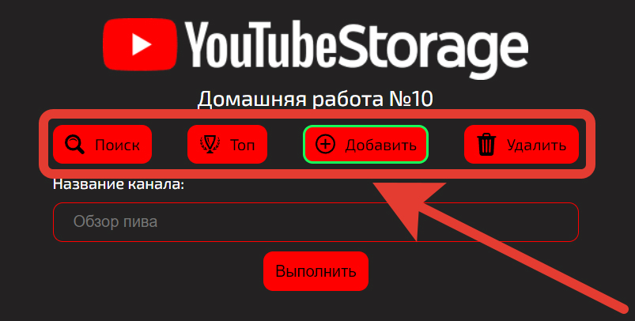
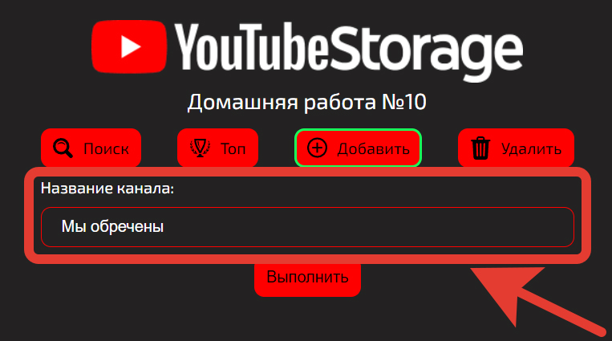
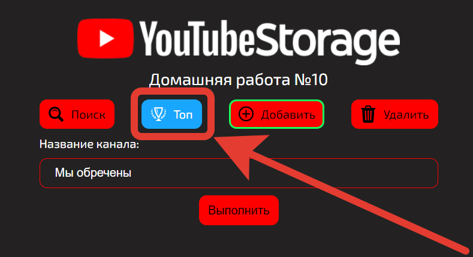
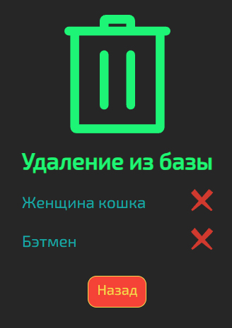
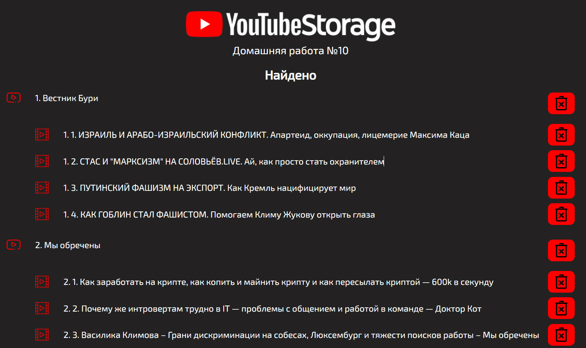
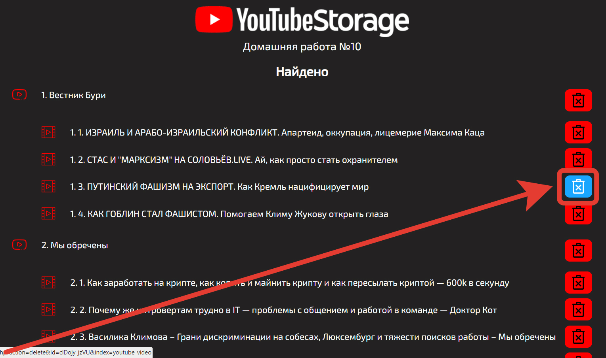

# Домашняя работа №10 - Другие SQL-решения

## Выполнил: Мелёшкин В.В.

В ходе реализации данной домашней работы было разработано приложение для анализа и хранения данных о YouTube каналах.
Данные приложения получаются при помощи **YouTube API** хранятся в поисковом движке **Elasticsearch**

### Инструкция

Управление приложением осуществляется при помощи четырёх кнопок:

У приложения имеется 4-фичи:

#### Добавлние информации о канале

Это стартовая функция приложения:

Для добавления канала в базу, достаточно просто ввести его название в соответствующее поле:

После чего нажать на кнопку **Выполнить**. В случае успешного добавления данных о канале будет выполнена переадресация
на страницу с соответствующей информацией:

#### Топ

Данная функция показывает лучшие каналы. Для этого достаточно нажать на соответствующую кнопку:

После чего появится топ каналов по числу лайков:

#### Поиск

При помощи поиска можно найти данные о любом канале и его видео. Для этого достаточно нажать на соответствующую кнопку:

Далее нужно ввести в поле поиска название канала:

После чего появится страница с результатами поиска:

#### Удаление

Для того чтобы перейти на страницу удаления элементов из базы, достаточно кликнуть по соответствующей кнопке:

После чего откроется страница удаления:

Для удаления элемента достаточно кликнуть по соответствующей кнопке на против него:

После чего вы окажетесь на страницу которая сообщит об успешном удалении данных:

