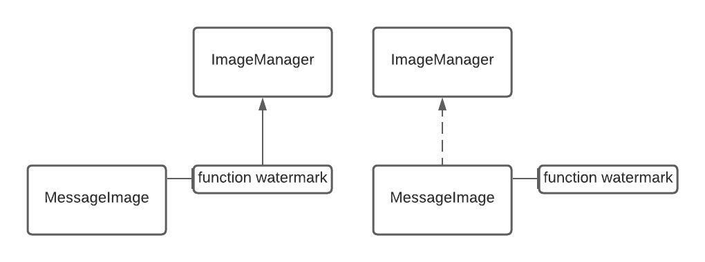
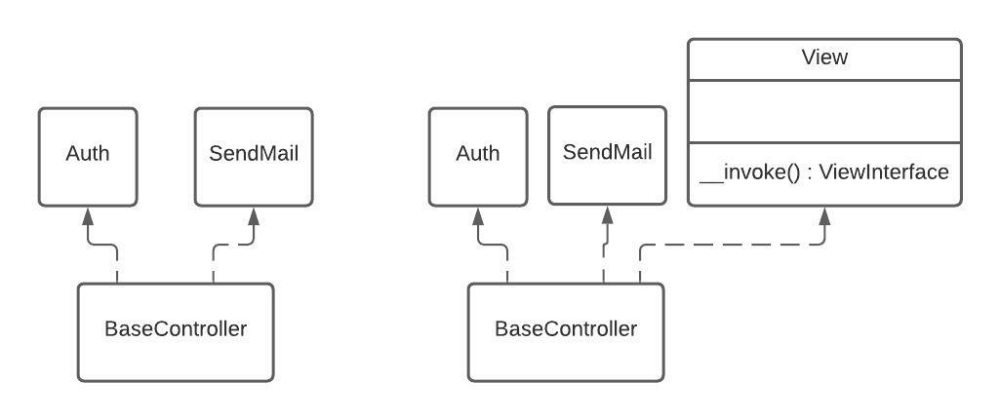
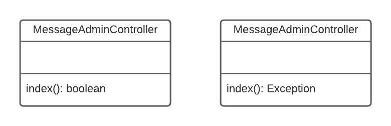
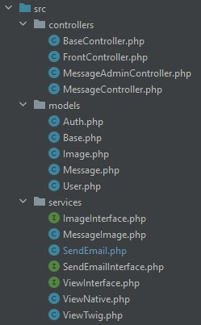
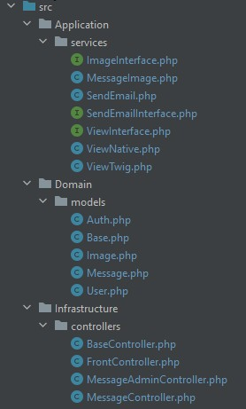
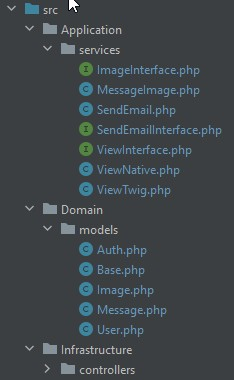
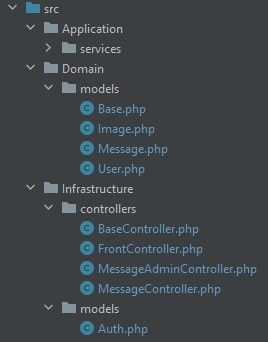
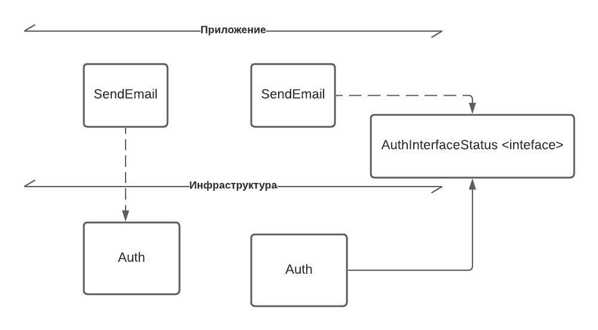
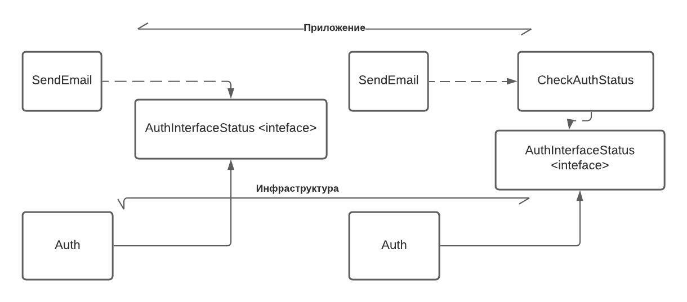
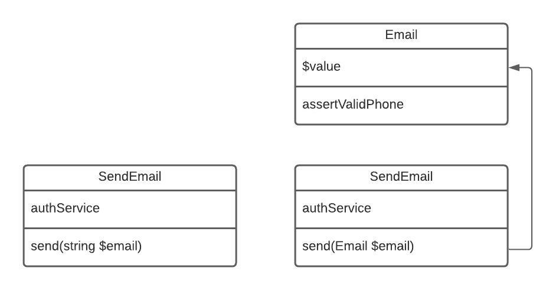

Разделитель _____ внутри кода делит на "ДО" и "ПОСЛЕ"

1. Все методы этого класса зависят напрямую от класса ImageManger,
   поэтому необходимо добавить зависимость от ImageManager в конструктор

````
class MessageImage implements ImageInterface
{

    public function watermark($file)
    {
        $imageManager = new ImageManager();
        $image = $imageManager->make($file);
        $image
            ->resize(200, null, function ($image) {
                $image->aspectRatio();
            })
            ->text (
                "lolololo",
                100,
                null,
                function ($font) {
                    $font->size(40);
                    $font->color(array(255, 0, 0, 0.5));
                    $font->align("center");
                    $font->valign("center");
                }
            )
            ->save($file);

        return 0;
    }
}

_____

class MessageImage implements ImageInterface
{
    private $imageManger;

    public function __construct(ImageManager $imageManager)
    {
        $this->imageManager = $ImageManager;
    }

    public function watermark($file)
    {
        $imageManager = new ImageManager();
        $image = $imageManager->make($file);
        $image
            ->resize(200, null, function ($image) {
                $image->aspectRatio();
            })
            ->text (
                "lolololo",
                100,
                null,
                function ($font) {
                    $font->size(40);
                    $font->color(array(255, 0, 0, 0.5));
                    $font->align("center");
                    $font->valign("center");
                }
            )
            ->save($file);

        return 0;
    }
}
````

2. Внутри базового класса для всех контроллеров вручную инициализировались
   объекты, а так-же есть условие, в зависимости от соблюдения которого инициализируется объект того или иного класса рендера. Необходимо создать зависимости в конструкторе и перенести инициализацию класса рендера в другой класс
````
    public function __construct()
    {
        $this->auth = new Auth();
        $this->sendEmail = new SendEmail();
        if (!empty(VIEW_TYPE) && VIEW_TYPE == 'twig') {
            $this->view = new ViewTwig();
        } else {
            $this->view = new ViewNative();
        }
    }
    
    _____
    
    public function __construct(Auth $auth, SendEmail $sendMail, View $view)
    {
        $this->auth = new Auth();
        $this->sendEmail = new SendEmail();
        $this->view = $view();
    }
    
    class View
    {
         public function __invoke()
         {
              if (!empty(VIEW_TYPE) && VIEW_TYPE == 'twig') {
                return new ViewTwig();
              } else {
                return new ViewNative();
              }
         }
    }
````   

3. Предлагаю выбрасывать исключение, чтобы перехватывать его с помощью класса хэндлера, а не перекладывать ответственность на класс, вызывающий контроллер
````
class MessageAdmin extends BaseService
{
    public function index()
    {
        if (!in_array($this->auth->user()['id'], ADMIN_ID)) {
            return 0;
        }
    _____
    public function index()
    {
        if (!in_array($this->auth->user()['id'], ADMIN_ID)) {
            throw new Exception('user is not admin');
        }
````

4. Предлагаю создать отдельный DTO
````
class MessageAdmin extends BaseService
{
    public function index()
    {
        if (!in_array($this->auth->user()['id'], ADMIN_ID)) {
            return 0;
        }
        $messageModel = new Message();
        $imageModel = new Image();
        if (empty($_POST)) {
            $allMessages = $messageModel->getAll();
            $messageModel->delete(key($_GET));
            return $this->view->render('front/messageAdmin', ['allMessages' => $allMessages, 'allIdWithImages' => $messageModel->getAllIdWithImages()]);
        }
        if ($this->auth->quest()) {
            throw new \Exception('Permission denied');
        }
        $userId = $this->auth->user()['id'];
        $messageModel->add($userId, boolval($_FILES['userfile']['tmp_name']), $_POST['text']);
        if (!empty($_FILES['userfile']['tmp_name'])) {
            $imageModel->add($_FILES['userfile']['tmp_name']);
        }
        $this->redirect('/message/indexAdmin');
    }


}

class Message extends Base
{
    public function add($userId, $isSetImage, $text)
    {
        $sql = "INSERT INTO `messages` (text, `date`, isset_image, user_id) VALUES (:text, :date, :isset_image,:user_id)";
        $statement = $this->getConnect()->prepare($sql);
        $result = $statement->execute(["text" => $text,
            "date" => date("y.m.d"),
            "isset_image" => $isSetImage ? 1 : 0,
            "user_id" => $userId
        ]);
        return $result;
    }
}
_____
class Message extends Base
{
    public function add(MessageDTO $message)
    {
        $sql = "INSERT INTO `messages` (text, `date`, isset_image, user_id) VALUES (:text, :date, :isset_image,:user_id)";
        $statement = $this->getConnect()->prepare($sql);
        $result = $statement->execute(["text" => $message->text,
            "date" => date("y.m.d"),
            "isset_image" => $message->isSetImage ? 1 : 0,
            "user_id" => $message->userId
        ]);
        return $result;
    }
}

class MessageAdmin extends BaseService
{
    public function index()
    {
        if (!in_array($this->auth->user()['id'], ADMIN_ID)) {
            return 0;
        }
        $messageModel = new Message();
        $imageModel = new Image();
        if (empty($_POST)) {
            $allMessages = $messageModel->getAll();
            $messageModel->delete(key($_GET));
            return $this->view->render('front/messageAdmin', ['allMessages' => $allMessages, 'allIdWithImages' => $messageModel->getAllIdWithImages()]);
        }
        if ($this->auth->quest()) {
            throw new \Exception('Permission denied');
        }
        $userId = $this->auth->user()['id'];
        $message = new MessageDTO($userId, boolval($_FILES['userfile']['tmp_name']), $_POST['text'])
        $messageModel->add($message);
        if (!empty($_FILES['userfile']['tmp_name'])) {
            $imageModel->add($_FILES['userfile']['tmp_name']);
        }
        $this->redirect('/message/indexAdmin');
    }


}

class MessageDTO
{
    public $userId;
    
    public $isSetImage;
    
    public $text;
}

````

5. Изменена структура папок на "инфраструктура" / "приложение" / "домен"

До:



После:



6. Вынес класс Auth, отвечающий за авторизацию и проверку авторизации пользователя
   в папку Infrastructure и создал для него интерфейс src/Application/services/AuthInterface.php, тк это низкоуровневый код, который не изменится. Теперь внутри класса BasePrice инициализируется
   сервис Auth, не нарушая принципы зависимости.

````
class Auth
{
    /**
     *
     */
    const SESSION_INDEX_USER = 'user';

    /**
     * @return array|null
     */
    public function user()
    {
        return $_SESSION[self::SESSION_INDEX_USER];
    }

    /**
     * @return bool
     */
    public function quest()
    {
        return empty($_SESSION[self::SESSION_INDEX_USER]);
    }

    /**
     * @param array $user
     */
    public function login(array $user)
    {
        $_SESSION[self::SESSION_INDEX_USER] = $user;
    }

    /**
     *
     */
    public function logout()
    {
        $_SESSION[self::SESSION_INDEX_USER] = null;
    }
}
````

До:



После:



7. Добавлен интерфейс c описанием методов проверки статуса юзера на уровень приложения, чтобы была возможность вызывать класс Auth из раздела инфраструктуры
````
interface AuthInterfaceStatus
{
    public function user();
    public function quest();
}

class Auth implements AuthInterfaceStatus
{
    /**
     *
     */
    const SESSION_INDEX_USER = 'user';

    /**
     * @return array|null
     */
    public function user()
    {
        return $_SESSION[self::SESSION_INDEX_USER];
    }

    /**
     * @return bool
     */
    public function quest()
    {
        return empty($_SESSION[self::SESSION_INDEX_USER]);
    }

    /**
     * @param array $user
     */
    public function login(array $user)
    {
        $_SESSION[self::SESSION_INDEX_USER] = $user;
    }

    /**
     *
     */
    public function logout()
    {
        $_SESSION[self::SESSION_INDEX_USER] = null;
    }
}
````

Например, в классе SendMail
````
class SendEmail implements SendEmailInterface
{
    private $authService;

    public function __construct(Auth $authService)
    {
        $this->authService = $authService;
    }
    /**
     * Отправка сообщения об успешной регистрации
     * @param $email
     * @return mixed|void
     */
    public function send($email)
    {
        $transport = (new Swift_SmtpTransport(EMAIL_HOST, EMAIL_PORT))
            ->setUsername(USERNAME)
            ->setPassword(EMAIL_PASS);

        $mailer = new Swift_Mailer($transport);

         $body = 'Reg success';

        if ($this->authService->user()) {
            $body = 'Reg another account success';
        }

        $message = (new Swift_Message('Reg'))
            ->setFrom([EMAIL_TO => $email])
            ->setTo([$email])
            ->setBody($body);

        $mailer->send($message);
    }
}
_____
class SendEmail implements SendEmailInterface
{
    private $authService;

    public function __construct(AuthInterfaceStatus $authService)
    {
        $this->authService = $authService;
    }
    /**
     * Отправка сообщения об успешной регистрации
     * @param $email
     * @return mixed|void
     */
    public function send($email)
    {
        $transport = (new Swift_SmtpTransport(EMAIL_HOST, EMAIL_PORT))
            ->setUsername(USERNAME)
            ->setPassword(EMAIL_PASS);

        $mailer = new Swift_Mailer($transport);

        $body = 'Reg success';

        if ($this->authService->user()) {
            $body = 'Reg another account success';
        }

        $message = (new Swift_Message('Reg'))
            ->setFrom([EMAIL_TO => $email])
            ->setTo([$email])
            ->setBody($body);

        $mailer->send($message);
    }
}
````

8. Добавлен UseCase CheckAuthStatusInterface на уровень Application, чтобы в классе SendEmail, из прошлого примера мы не использовали
   объекта класса, который имеет избыточные методы, выходящие за пределы описания интерфейса AuthInterfaceStatus, а использовали класс, внутри которого реализация лишь тех методов, которые требуется в контексте задачи

````
class SendEmail implements SendEmailInterface
{
    private $authService;

    public function __construct(AuthInterfaceStatus $authService)
    {
        $this->authService = $authService;
    }
    /**
     * Отправка сообщения об успешной регистрации
     * @param $email
     * @return mixed|void
     */
    public function send($email)
    {
        $transport = (new Swift_SmtpTransport(EMAIL_HOST, EMAIL_PORT))
            ->setUsername(USERNAME)
            ->setPassword(EMAIL_PASS);

        $mailer = new Swift_Mailer($transport);

        $body = 'Reg success';

        if ($this->authService->user()) {
            $body = 'Reg another account success';
        }

        $message = (new Swift_Message('Reg'))
            ->setFrom([EMAIL_TO => $email])
            ->setTo([$email])
            ->setBody($body);

        $mailer->send($message);
    }
}
_____
interface CheckAuthStatusInterface
{
    public function user();
    public function quest();
}

class CheckAuthStatus implements CheckAuthStatusInterface
{   
    private $authService;
   
    public function __construct(AuthInterfaceStatus $authService)
    {
        $this->authService = $authService;
    }

    /**
     * @return array|null
     */
    public function user()
    {
        return $this->authService->user();
    }

    /**
     * @return bool
     */
    public function quest()
    {
        return $this->authService->quest();
    }
}

class SendEmail implements SendEmailInterface
    {
        private $authService;

        public function __construct(CheckAuthStatus $authService)
        {
            $this->authService = $authService;
        }
        /**
         * Отправка сообщения об успешной регистрации
         * @param $email
         * @return mixed|void
         */
        public function send($email)
        {
            $transport = (new Swift_SmtpTransport(EMAIL_HOST, EMAIL_PORT))
                ->setUsername(USERNAME)
                ->setPassword(EMAIL_PASS);

            $mailer = new Swift_Mailer($transport);

            $body = 'Reg success';

            if ($this->authService->user()) {
                $body = 'Reg another account success';
            }

            $message = (new Swift_Message('Reg'))
                ->setFrom([EMAIL_TO => $email])
                ->setTo([$email])
                ->setBody($body);

            $mailer->send($message);
        }
    }
````

9. Добавлен valueObject класс Email и зависимость от него в метод send, внутрь которого передается email, чтобы
   не было возможности передать невалидный email
````
        public function send($email)
        {
            $transport = (new Swift_SmtpTransport(EMAIL_HOST, EMAIL_PORT))
                ->setUsername(USERNAME)
                ->setPassword(EMAIL_PASS);

            $mailer = new Swift_Mailer($transport);

            $body = 'Reg success';

            if ($this->authService->user()) {
                $body = 'Reg another account success';
            }

            $message = (new Swift_Message('Reg'))
                ->setFrom([EMAIL_TO => $email])
                ->setTo([$email])
                ->setBody($body);

            $mailer->send($message);
        }
        
_____

class Email
{
    private $value;

    /**
     * @param  string  $value
     */
    public function __construct( $value)
    {
        $this->assertValidEmail($value);
        $this->value = $value;
    }

    private function assertValidEmail($value)
    {
        if (!filter_var($value, FILTER_VALIDATE_EMAIL)) {
            throw new \InvalidArgumentException("Невалидный EMAIL");
        }
    }

    /**
     * @return string
     */
    public function getValue()
    {
        return $this->value;
    }
}
   
      public function send(Email $email)
        {
            $email = $email->getValue();
            $transport = (new Swift_SmtpTransport(EMAIL_HOST, EMAIL_PORT))
                ->setUsername(USERNAME)
                ->setPassword(EMAIL_PASS);

            $mailer = new Swift_Mailer($transport);

            $body = 'Reg success';

            if ($this->authService->user()) {
                $body = 'Reg another account success';
            }

            $message = (new Swift_Message('Reg'))
                ->setFrom([EMAIL_TO => $email])
                ->setTo([$email])
                ->setBody($body);

            $mailer->send($message);
        }
````
 