# Домашняя работа №9 - Как устроен PostgreSQL 

## Оптимизация базы данных на СУБД PostgreSQL

### Наполнения базы данных

Для выполнения данной домашней работы, в качестве основы была использована база данных разработанная в ходе 
[Домашней работы №7](https://github.com/otusteamedu/PHP2021/tree/VMeleshkin/HW-7). В соответствии с требованиями текущей
домашней работы, для наполнения базы данных были написаны два скрипта: до [10 000](ten_thousand.sql) строк и до
[100 000](one_hundred_thousand.sql).

### Запрос №1

Все оплаченные заказы:
```postgresql
SELECT * FROM "order" WHERE status = 'PAID';
```
Чтобы измерить производительность запросов мы будем использовать команду PostgreSQL `EXPLAIN`, которая выводит план 
выполнения, дающий представление о времени потраченном на каждом этапе запроса. Так же чтобы получить максимально
подробный отчёт мы расширим эту команду параметрами `ANALYZE` и `BUFFERS`.

И так для базы данных размером в 10 000 строк команда `EXPLAIN` выдаёт следующий результат:

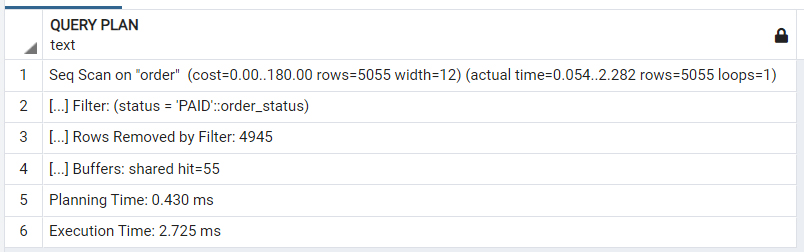

А для базы данных в 100 000 следующий:

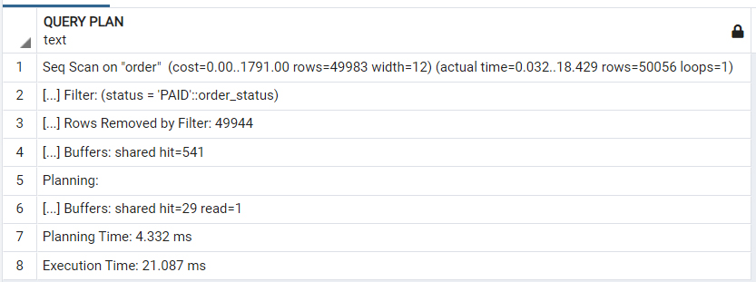

Как видно из отчёта планировщик избрал для данного запроса метод `Seq Scan`, в его основе лежит пожалуй самый простой
алгоритм это - **Последовательное сканирование** (*англ* - sequential scanning) - в котором PostgreSQL открывает
указанную таблицу и просто, последовательно читает одну строку за одной возвращая её пользователю или родительской
команде.

В первой строке отчёта мы такое значение как `cost`, это стоимость нашего запроса. Стоимость запроса выражена в
абстрактных единицах и разделена на две части: `0.00.. 180.00`. Первая часть означает стоимость получения первого 
значения, второе суммарную стоимость запроса. В обоих наших случаях первая часть стоимости равна нулю, связано это с тем
что стоимость получения первого запроса обычно возникает у сложных запросов, на планирование которых нужно затратить
некоторое время перед исполнением. `Seq Scan` является одним из самых простых методов в PostgreSQL, поэтому на его
планирование времени практически не тратится, он сразу начинает исполняться.

Ещё из интересных значений в отчёте можно отметить **Execution time**, которое как не трудно догадаться обозначает время
выполнения запроса исчисляемое в миллисекундах.

И так как мы видим из отчёта для базы данных в 10 000 строк, стоимость запроса составляет: **180.00**, а время его
выполнения равно **2.725** миллисекундам. Для базы данных в 100 000 стоимость запроса равна **1791.00**, а время
выполнения составит **21.087** миллисекунд.

Десятикратная разница в стоимости одного и того-же запроса, легко объясняется десятикратной разницей в размерах двух баз
баз данных.

И так приступим к оптимизации, для этого создадим индекс по полю **status**:
```postgresql
CREATE INDEX order_status_idx ON "order" (status);
```

Замерим результат после создания индекса. Для базы данных в 10 000 строк мы получаем:

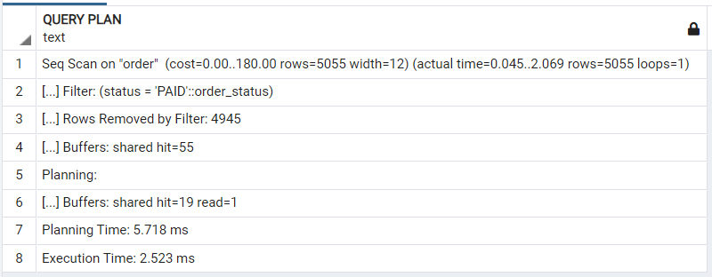

А для базы данных в размером в 100 000:

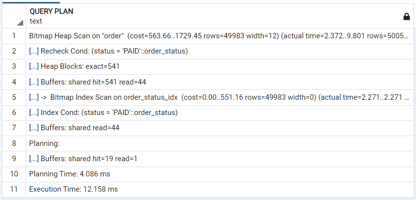

Как не сложно заметить, создание индекса не дало результата. Для базы данных размером в 10 000 строк стоимость запроса 
так и осталась равной **180**, а для базы данных в 100 000 строк уменьшилась незначительно с **1791.00** до **1729.45**.
То есть индексирование не дало ожидаемого результата.

Продолжим оптимизацию базы данных и создадим партицию:
```postgresql
CREATE TABLE order_paid () INHERITS ("order");
ALTER TABLE order_paid ADD CONSTRAINT partition_check CHECK (status = 'PAID');
INSERT INTO order_paid (order_id, client_id, status)
SELECT *
FROM "order"
WHERE status = 'PAID';
DELETE FROM ONLY "order" WHERE status = 'PAID';
```
Суть партиций заключается в том что мы разбиваем одну большую родительскую таблицу, и переносим часть данных в дочерние 
дочерние таблицы, с аналогичной структурой. При этом всё запросы останутся прежними, как будто бы обращаемся только к
одной таблице. Обойти подобное поведение и обратиться к конкретной таблице помогает команда `ONLY`.

Конкретно в нашем случае, разделение происходит на основе поля **status**, и в дочернюю таблицу будут попадать только
проданные заказы.

После создания партиции повторим анализ нашего запроса. Для базы данных в 10 000 строк получим:

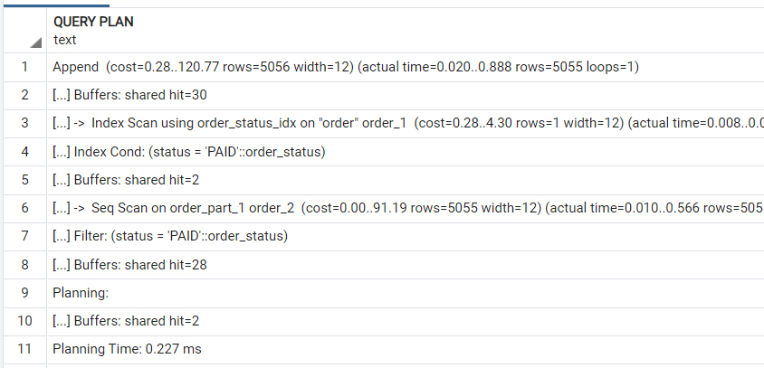

А для базы данных в 100 000 имеем такой результат:

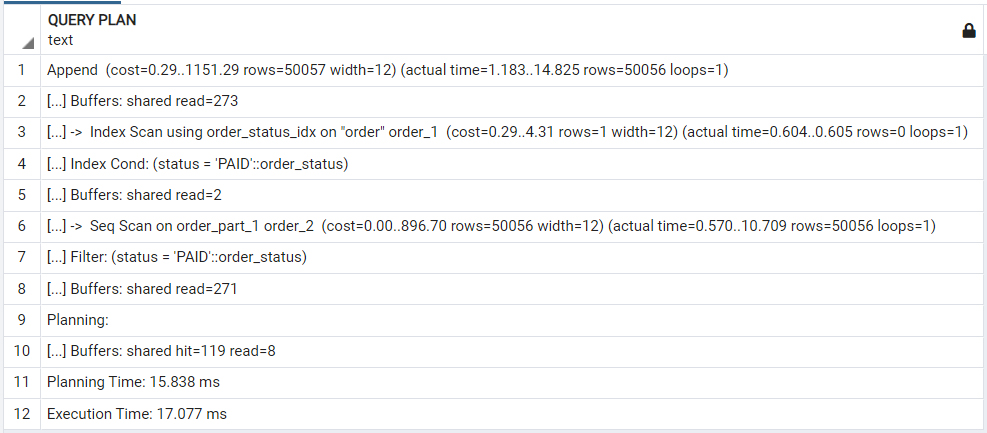

Как видно из плана планировщик сперва инициализирует запуск операции `Append` которая в свою очередь, запускает ряд
субопераций и возвращает полученные от них строки в виде общего результата. Конкретно в нашем случае, в роли субопераций
выступают:

- **Index Scan** - это сканирование по индексу. Как можно заметить по отчёту созданный нами, на предыдущем этапе индекс 
по полю **status**, таки пригодился;
- **Seq Scan** - последовательное сканирование о котором уже говорилось выше.

И так для базы данных в 10 000 строк стоимость запроса составила **120.77** что почти на **60** баллов дешевле, чем до
применения партицирования. А для базы данных в 100 000 стоимость запроса сократилась на **640** баллов, до **1151.29**
балла. Как можно заметить в этот раз оптимизация базы данных оказалась вполне успешной и стоимость запроса к обеим базам
базам данных снизилась на схожие в процентном отношении числа.

**Вывод:** создание партиции по полю **status** положительно сказалось на оптимизации запроса в котором это поле
использовалось. Созданный на первом этапе оптимизации индекс по полю **status**, так же был использован и положительно
сказался на снижении стоимости запроса.

### Запрос №2
Фильмы с возрастным ограничением 18+ и продолжительностью менее 120 минут:
```postgresql
SELECT * FROM film WHERE age_limit >= 18 AND duration <= 120;
```
Проанализировав данный запроса для базы данных в 10 000 строк, получаем следущий результат:

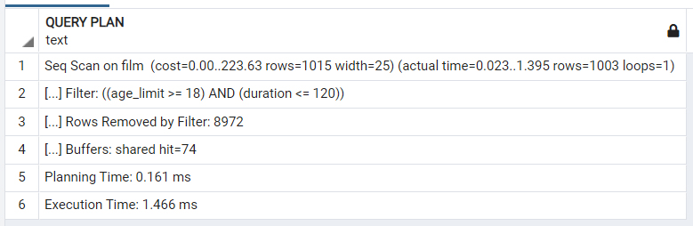

А для базы данных в 100 000 строк такой:

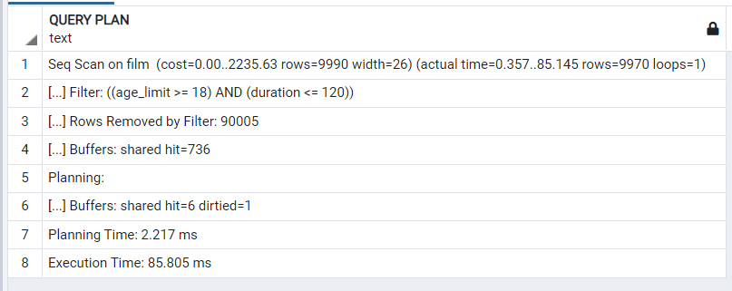

Как видно из предоставленного плана стоимость данного запроса в БД размером 10 000 строк равно **223.63**, а в БД в 
100 000 равно **2235.65**. Десятикратный рост стоимости объясним, десятикратной разницей в размерах двух баз данных. 
Для оптимизации данного запроса мы создадим индекс:
```postgresql
CREATE INDEX film_duration_idx ON film (duration);
```
После создания индекса повторим команду `EXPLAIN` для нашего запроса. Для базы данных в 10 000 строк мы получим такой
следующий результат:
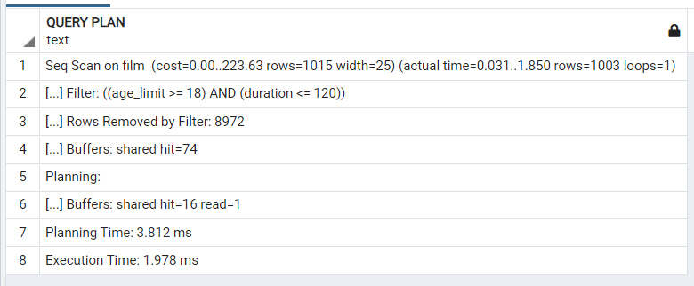

А для базы данных размером в 100 000 строк такой:

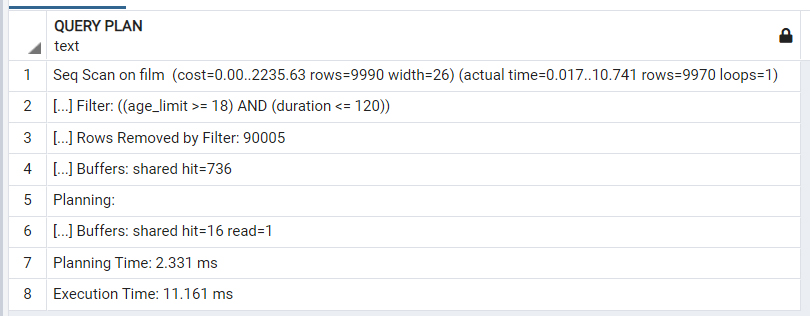

Как не сложно заметить добавление индекса, абсолютно не как не повлияло на стоимость запроса.

Что-же продолжим работу по оптимизации и создадим ещё один индекс, на этот раз на основе поля `age_limit`:
```postgresql
CREATE INDEX film_age_limit_idx ON film (age_limit);
```
Повторяем анализ нашего запроса и для базы данных в 10 000 строк получаем следующий результат:

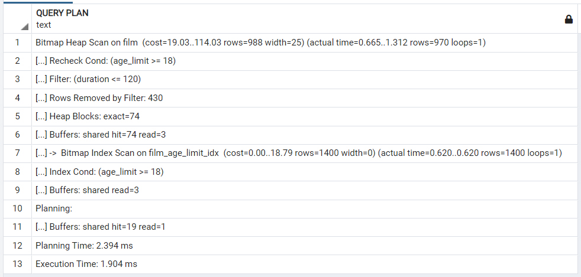

А для базы данных размером в 100 000 строк, получаем такой результат:

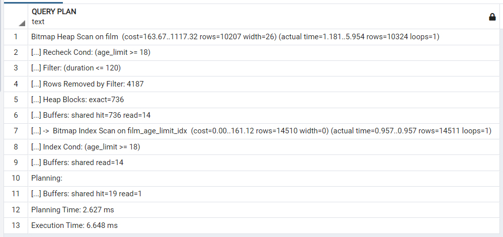

После создания второго индекса получаем весьма заметные изменения. Имея индекс планировщик разделил выполнения запроса
на 2-ва этапа:
- **Bitmap Index Scan** - на этом этапе из индекса находятся адреса строк соответствующих запросу;
- **Bitmap Heap Scan** - осуществляется последовательное сканирование по строкам найденным на предыдущем этапе.

Таким образом удаётся ускорить процесс выполнения запроса и снизить его стоимость. Так для базы данных в 10 000 строк
стоимость запроса упала почти в двое с **223.64** до **114.03**.

Для базы данных на 100 000 имеет схожее увеличение производительности, стоимость запроса также сократилась в двое с
**2235.64** до **1117.32**. Время выполнения запроса сократилось с **11.161** миллесекунды, до **6.648**, что быстрее на
**41%**.

**Вывод:** добавление индекса на основе поля `age_limit`, положительно сказалось на производительности запроса.

## Запрос №3

Сеансы за конкретный период:
```postgresql
SELECT * FROM session 
WHERE session_datetime >= TIMESTAMP '2022-06-01 00:00:00' 
AND session_datetime < TIMESTAMP '2022-10-07 00:00:00';
```
Проверив производительность данного запроса на базе данных размером в 10 000 строк получим:

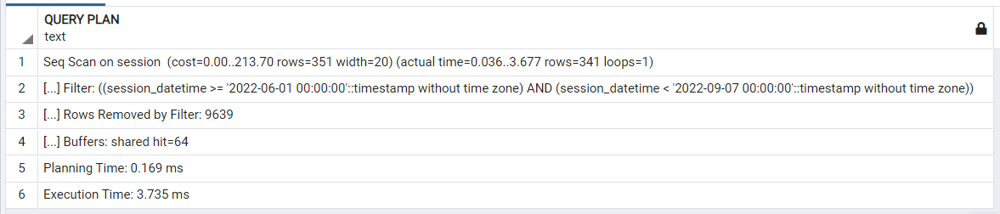

А для базы данных в 100 000 строк имеем результат:

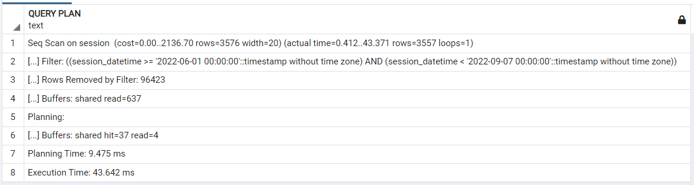

Таким образом для базы данных в 10 000 строк стоимость запроса составляет **213.70**, и он займёт по времени **3.735**
миллисекунды. А для базы данных в 100 000 строк стоимость запроса составит **2136.70** миллексекунд и время исполнения
будет равно **43.642** миллисекунды. И тут мы снова можем обратить на то что разница в стоимости и времени выполнения
запроса десятикратна, что обусловлено десятикратной разницей в размерах двух баз данных.

Для оптимизации данного запроса мы создадим индекс для таблицы **session**, по полю **session_datetime**:
```postgresql
CREATE INDEX session_idx ON session (session_datetime);
```
Измерим производительность нашего запроса после создания индекса. Для базы данных размером в 10 000 строк получим:

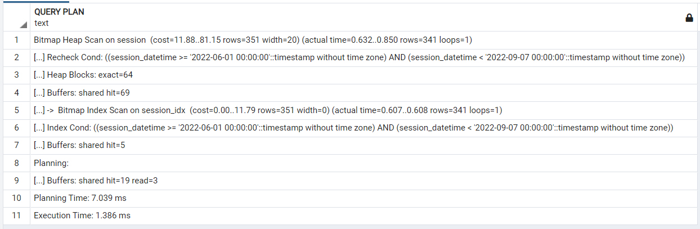

А для базы данных в 100 000 строк:

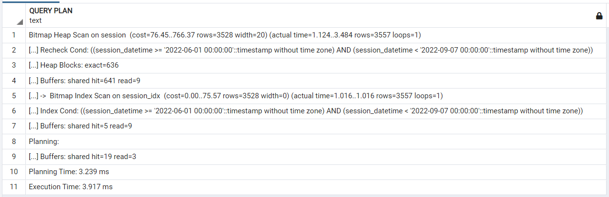

После создания индекса можно заметить схожесть с отчётом полученным, после аналогичной операции, с предыдущим запросом.

Создание индекса явно сказалось на улучшение производительности запроса. Для базы данных в 10 000 строк
стоимость запроса снизилась на **132** балла, то есть более чем в два с половиной раза до **81.15** балла. Время 
выполнения сократилась с **3.735** миллисекунд,  до **1.386**, что быстрее на **2.4** миллисекунды, что опять таки лучше 
почти в два с половиной раза, чем до оптимизации.

Для базы данных в 100 000 строк стоимость запроса сократилась с **2136.70** до **766.37** или на **1370** баллов, что
опять таки почти в два с половиной раза меньше чем до оптимизации. А вот время выполнения уменьшилось более чем
десятикратно с **43.642** миллисекунда, до **3.917** миллисекунд.

**Вывод:** создание индекса для таблицы **session**, по полю **session_datetime** положительно сказалось на запросе с
использованием данного поля.

## Запрос №4

Билеты стоимостью от 500 рублей и датой покупки не ранее суток от текущей даты:
```postgresql
SELECT * FROM ticket
 INNER JOIN seat ON seat.seat_id = ticket.seat_id
 INNER JOIN rows ON rows.row_id = seat.row
 WHERE price >= 300 AND (purchase_timestamp - CURRENT_TIMESTAMP) < '24:00:00'::interval;
```
Проанализировав данный запрос для базы данных в 10 000 строк получаем:

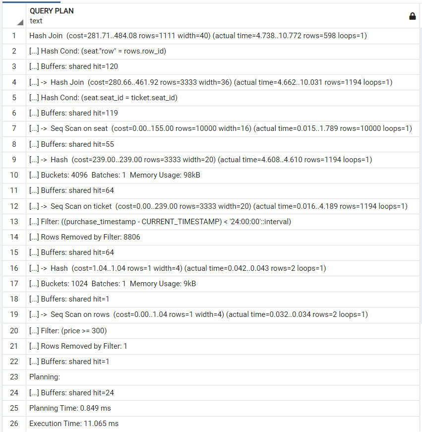

А для базы данных в 100 000 строк:

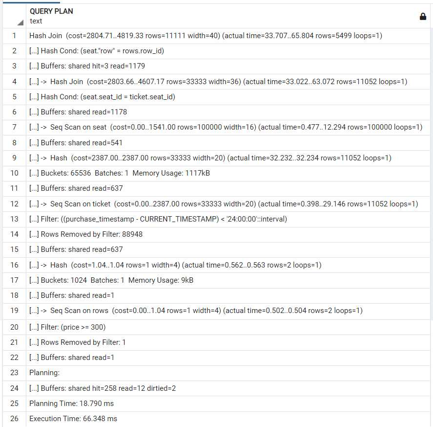

Как видно из отчёта в данном запросе планировшик решил использовать операцию Hash Join, которая в свою очередь состоит 
из двух субопераций:
 - Seq Scan;
 - Hash - создаёт хеш таблицу в оперативной памяти, на основе результатов предыдущей операции.
 

Таким образом стоимость запроса для базы в 10 000 запросов составила **484.08**, со временем выполненяи в **11.065**
миллесекунда. А для базы данных в 100 000 строк стоимость запроса составила **4819.33** и время выполнения равно 
**18.790** миллесекунд. И снова мы можем заметить корреляцию в стоимости запроса у двух баз данных, которая
прямопропорциональна их размеру.

И так приступим к оптимизации и начнём с создания индекса по полю **price**, таблицы **rows**:
```postgresql
CREATE INDEX rows_price_idx ON rows (price);
```
После создания индекса повторим анализ производительности запроса. Для базы данных в 10 000 строк получаем:

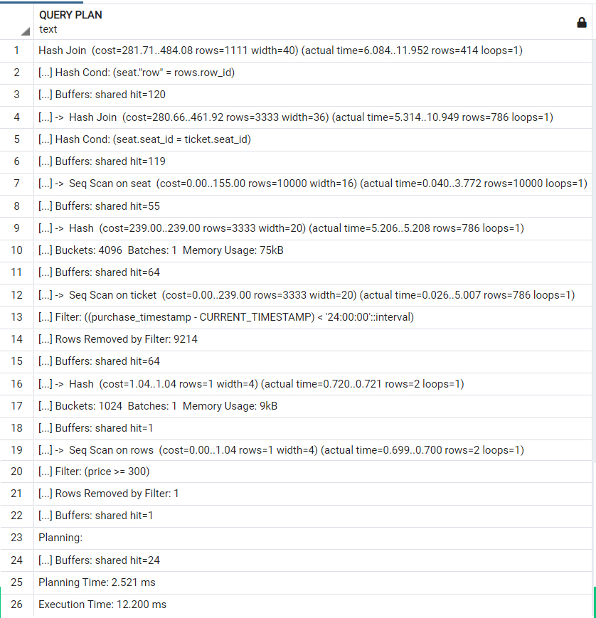

А для базы данных на 100 000 строк:

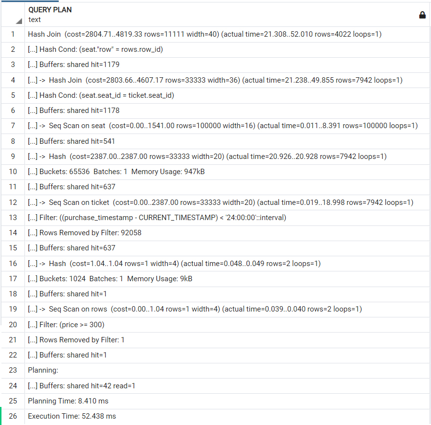

Как можно заметить логика выполнения запроса построенная планировшиком, практически не изменилась, как и не изменилась
стоимость запроса. Это означает что проведённой нами оптимизации не достаточно. Что-же как и с предшествующим запросом,
попробуем создать индекс по ещё одному полю, на этот раз этим полем станет "Время покупки":
```postgresql
CREATE INDEX ticket_purchase_time_idx ON ticket (purchase_timestamp);
```
И снова проанализируем производительность запроса. Для базы данных в 10 000 строк получаем:

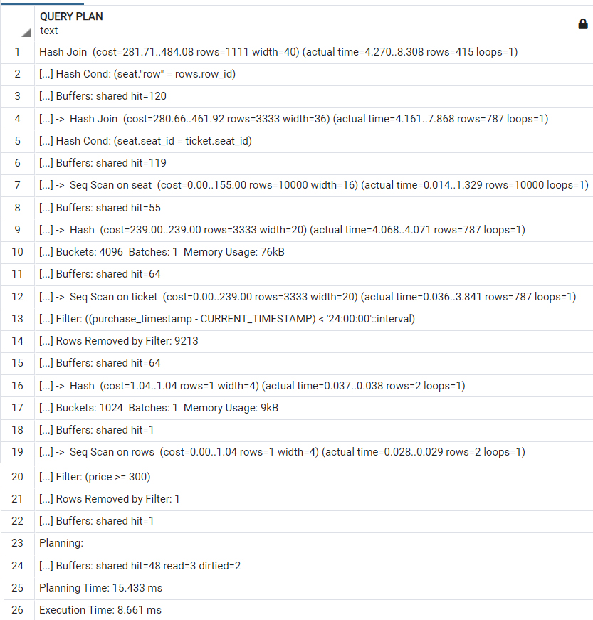

А для базы данных в 100 000 имеем следущий результат:

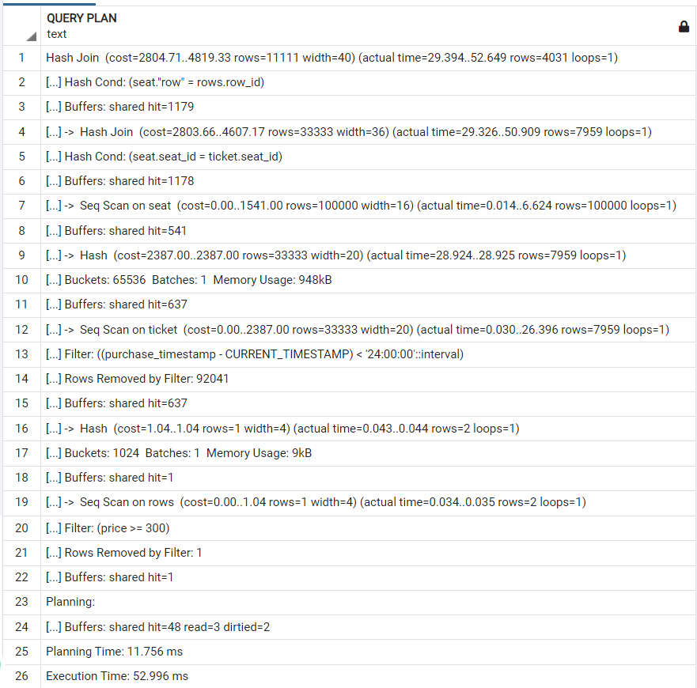

Как можно заметить создание второго индекса, не помогло снизить стоимость запроса, поэтому на следущем этапе
оптимизации мы создадим партициию, как и при оптимзации самого первого запроса:

```postgresql
ALTER TABLE order_to_ticket DROP CONSTRAINT ticket_fk;
CREATE TABLE ticket_part_1 () INHERITS (ticket);
ALTER TABLE ticket_part_1 ADD CONSTRAINT partition_check CHECK (purchase_timestamp < '2022-09-14 21:51:18.872183+03');
INSERT INTO ticket_part_1 (ticket_id, session_id, seat_id, purchase_timestamp)
SELECT *
FROM ticket
WHERE purchase_timestamp < '2022-09-14 21:51:18.872183+03';
DELETE FROM ONLY ticket WHERE purchase_timestamp < '2022-09-14 21:51:18.872183+03';
ALTER TABLE ONLY order_to_ticket
ADD CONSTRAINT ticket_fk FOREIGN KEY (ticket_id) REFERENCES ticket(ticket_id) NOT VALID;
```

В данной партиции мы разбиваем нашу таблицу на две, по дате покупки билета. Как можно заметить из запроса выше, сначала
нам пришлось удалить ограничение целостности `ticket_fk`, которое в противном случае не дало бы нам очистить таблицу
**ticket**. В конце нашего запроса мы востанавливаем удалённое на первом шаге орграничение целостности.

Снова проверим наш запрос. Для базы данных в 10 000 строк получаем:

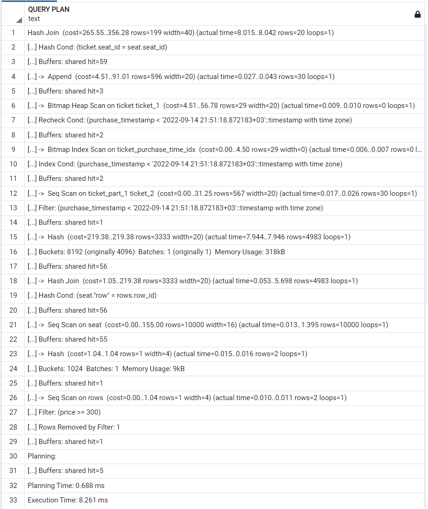

А для базы данных в 100 000 запросов:

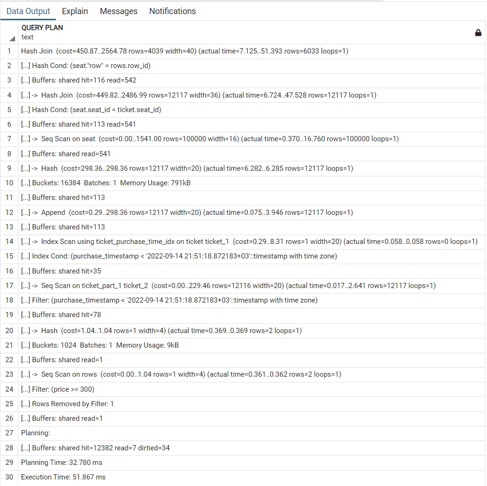

И так после создания партиции, нам удалось сократить стоимость запроса. Для базы данных в 10 000 строк она сократилась
на **128** баллов, до **356.28** баллов. Для базы данных в 100 000 сокращение ещё более солидное, а именно на 
**2255** баллов, до **2564.78**.

**Вывод:** создание партиции помогло сократить стоимость данного запроса.

## Запрос №5

Название фильма, дата и время показа и стоимость самого дорого билета на сеанс:
```postgresql
SELECT name, session_datetime, price FROM film
INNER JOIN session ON session.film_id = film.film_id
INNER JOIN ticket ON ticket.session_id = session.session_id
INNER JOIN seat ON seat.seat_id = ticket.seat_id
INNER JOIN rows ON row_id = row
WHERE seat.row = 3
GROUP BY name, session_datetime, price;
```
Проанализировав данный запрос, для базы данных в 10 000 строк получим:

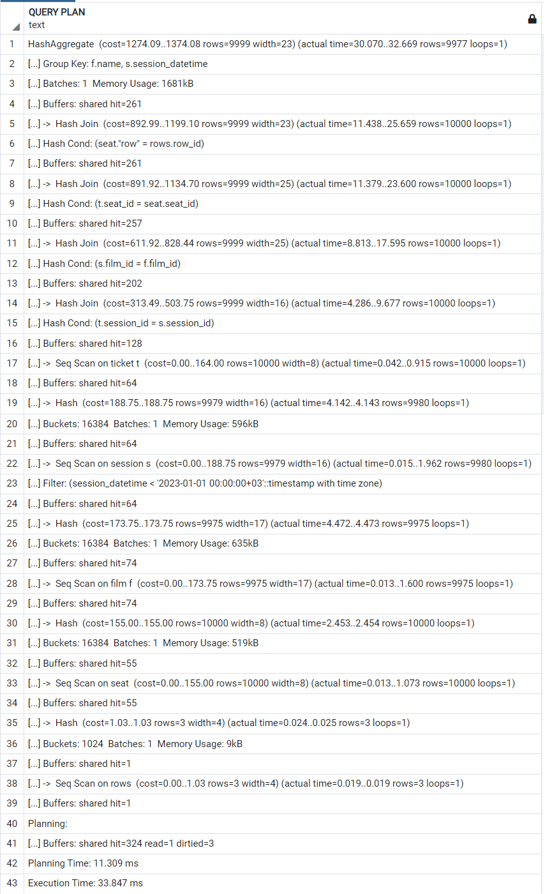

А для базы данных в 100 000 строк:

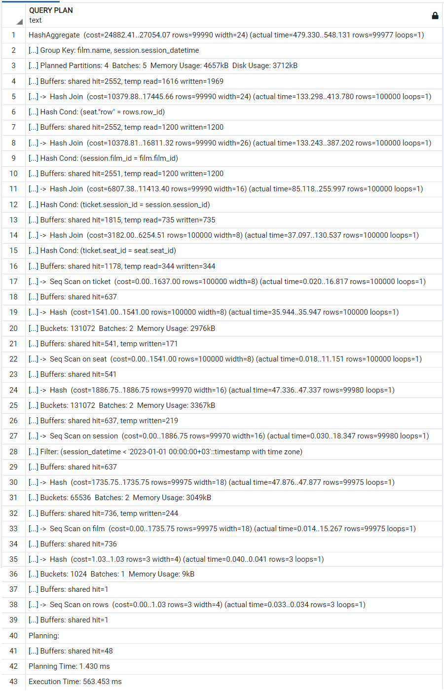

Оптимизацию начнем с создания индекса по полю **row** в таблице **seat**:
```postgresql
CREATE INDEX seat_row_idx ON seat (row);
```
Для базы данных в 10 000 строк получаем следующий результат после создания индекса:

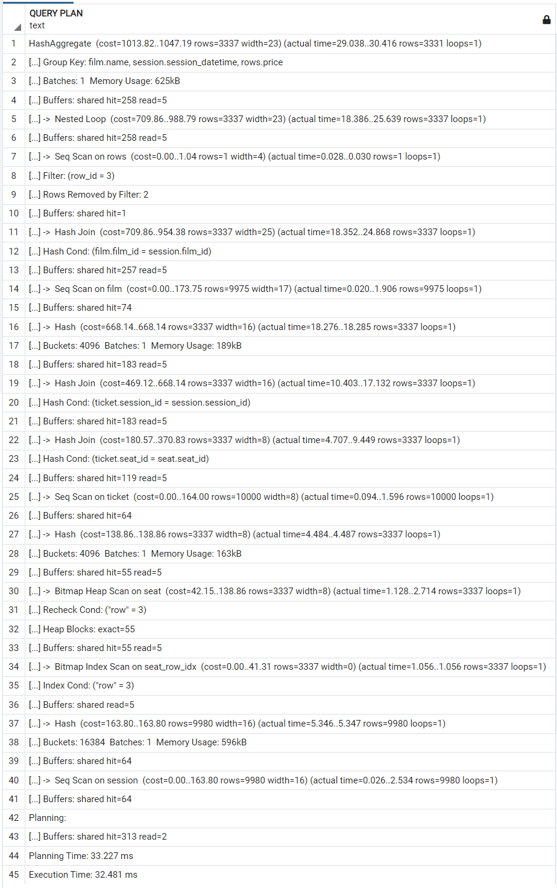

А для базы данных в 100 000 следующий:

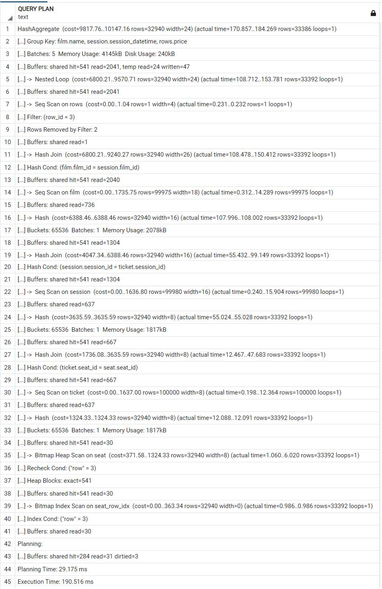

Как видно из отчёта, нам удалось добиться улучшения производительности после создания индекса. Для базы данных в
10 000 строк стоимость запроса снизилась на **327** баллов и составила **1047** баллов. А для базы данных в
100 000 результаты оптимизации более впечатляющие, стоимость запроса снизилась на **16 907** баллов и составила
**10 147** баллов.

**Вывод:** создание индекса по полю **row**, таблицы **seat** позволило оптимизировать работу запроса.

## Запрос №6

E-mail адреса всех клиентов купивших билеты:
```postgresql
SELECT email FROM client
INNER JOIN "order" AS ord ON ord.client_id = client.client_id
WHERE status = 'PAID';
```
Проанализировав наш запрос для базы данных в 10 000 строк мы получаем следующий результат:

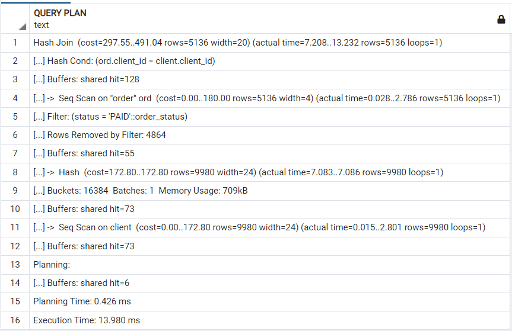

А для базы данных в 100 000 строк:

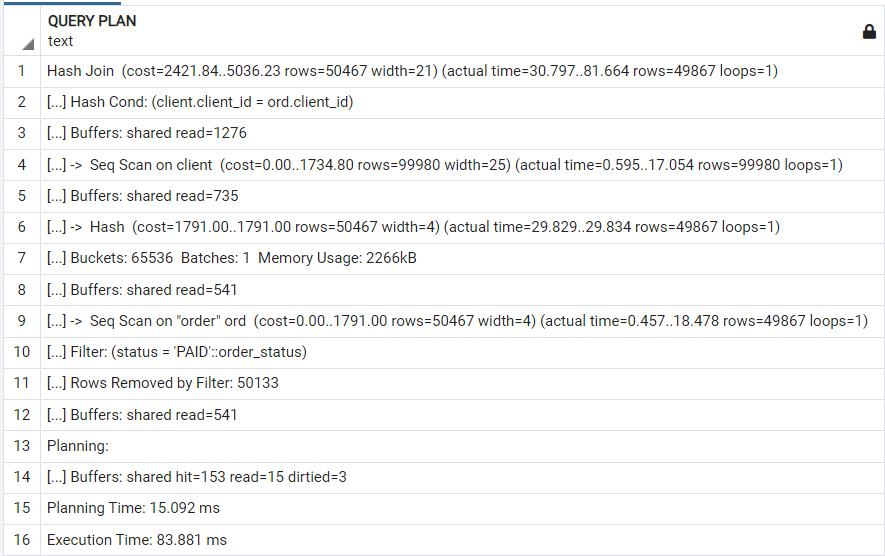

Приступим к оптимизации, сначала создадим индекс по полю **status**, таблице **order**:
```postgresql
CREATE INDEX order_status_idx ON "order" (status);
```
Снова измерим производительность запроса, для базы данных в 10 000 строк получаем:

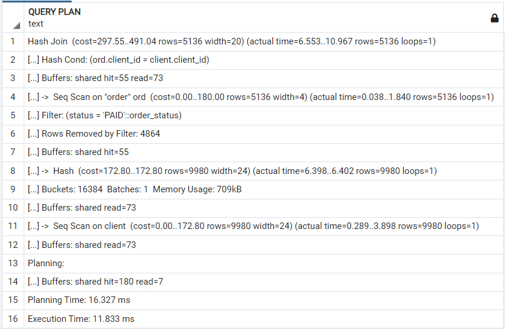

А для базы данных в 100 000 строк:

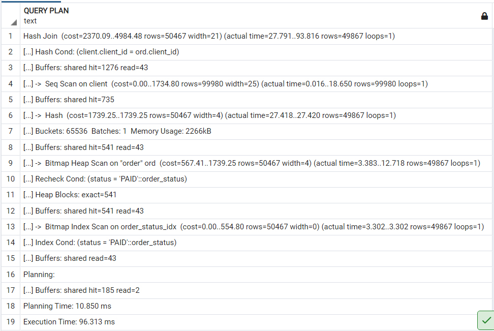

Как можно заметить для базы данных размеров в 10 000 строк видимых изменений в стоимости запроса не наблюдается. А для
базы данных в 100 000 строк стоимость снизилась незначительно с **5036.23** баллов до **4984.48** баллов.

Продолжим оптимизации и создадим партицию, которая создаст дочернюю таблицу, `order_paid` и перенесёт в неё все
оплаченные заказы:
```postgresql
CREATE TABLE order_paid () INHERITS ("order");
ALTER TABLE order_paid ADD CONSTRAINT partition_check CHECK (status = 'PAID');
INSERT INTO order_paid (order_id, client_id, status)
SELECT *
FROM "order"
WHERE status = 'PAID';
DELETE FROM ONLY "order" WHERE status = 'PAID';
```
Замерим производительность запроса после создания партиции. Для базы данных в 10 000 строк получаем следующий результат:

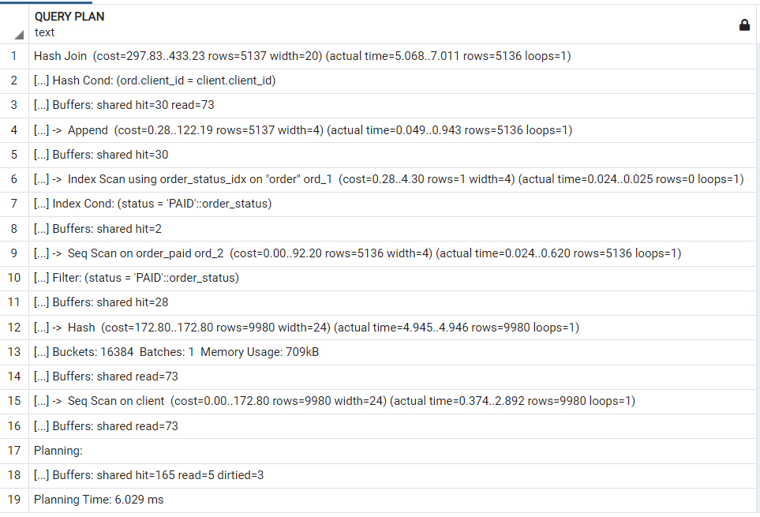

А для базы данных в 100 000 строк получаем такой результат:

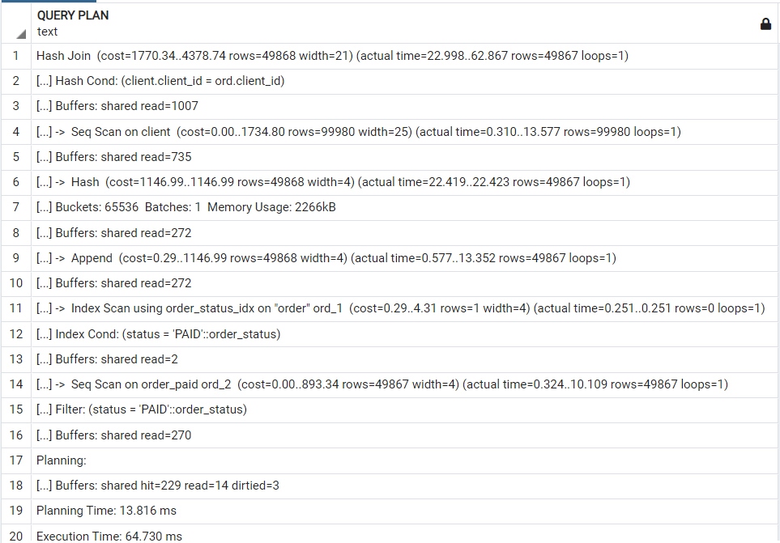

После создания партиции нам удалось добиться заметного снижения стоимости запроса. Для базы данных в 10 000 строк
снижение стоимости запроса составило **58** баллов с **491.04** балла до **433.23** баллов. А для базы данных в 100 000
строк стоимость запроса снизилась на **606** баллов, с **4984.48** баллов до **4378.74** баллов, в сравнении с
предыдущим этапом оптимизации.

**Вывод:** создании партиции позволило снизить стоимость данного запроса.

## Самые большие по размеру объекты базы данных

После проведения оптимизации базы данных, стоит посмотреть какие объекты в базе самые большие. Для этого был написан
специальный запрос, выводящий 15 самых больших объектов базы данных:
```postgresql
SELECT *
FROM
(SELECT
	all_indexes.name AS name,
	pg_relation_size(quote_ident(all_indexes.name)::text) AS size
FROM (SELECT indexrelname AS name FROM pg_stat_all_indexes WHERE indexrelname !~ 'pg_toast') AS all_indexes
UNION
SELECT
    TABLE_NAME AS name,
    total_size AS size
FROM (SELECT
        TABLE_NAME,
        pg_total_relation_size(TABLE_NAME) AS total_size
    FROM (
        SELECT ('"' || table_schema || '"."' || TABLE_NAME || '"') AS TABLE_NAME
        FROM information_schema.tables
    ) AS all_tables
    ORDER BY total_size DESC
) AS pretty_sizes) AS total
ORDER BY size DESC
limit 15;
```
Для базы данных в 10 000 строк получаем следующий результат:

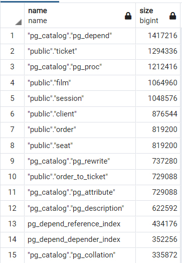

А для базы данных в 100 000 строк получаем:


Как видно самые крупные объекты в обоих базах данных схожи и в топ 3 входят:

1. Таблица с данными о билетах - **ticket**;
2. Таблица с данными о фильмах - **film**;
3. Таблица с данными о сеансах - **session**.

## 5-ть наиболлее часто используемых индексов

Для того чтобы получить 5-ть наиболее часто используемых индексов базы данных, был написан специальный запрос:
```postgresql
SELECT indexrelname, idx_scan
FROM pg_stat_all_indexes
ORDER BY idx_scan DESC
limit 5;
```
Для базы данных в 10 000 строк получаем следующий результат:

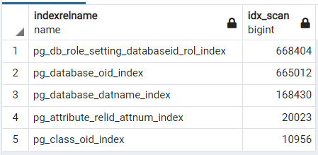

А для базы данных в 100 000 строк следующий:

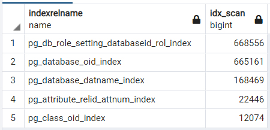

Как видно для обоих баз данных топ наиболее часто используемых индексов идентичен, и состоит из стандартных служебных
индексов PostgreSQL.

## 5-ть наименее часто используемых индексов

Для того чтобы получить 5-ть наименее часто используемых запросов, был написан следующий запрос:
```postgresql
SELECT indexrelname, idx_scan
FROM pg_stat_all_indexes
ORDER BY idx_scan ASC
limit 5;
```
Для базы данных в 10 000 строк получаем следующий результат:

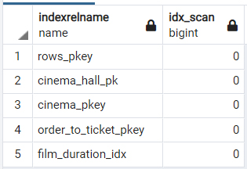

А для базы данных в 100 000 следующий:

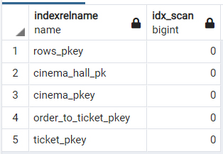

Как видно в целом результаты в обоих базах данных схожи, за исключением того что в базе данных на 10 000 строк в число
наименее часто используемых индексов попал индекс созданный нами в ходе работ оптимизации: **film_duration_idx**. В базе
данных в 100 000 строк, в пятёрку наименее используемых инексов входят только служебные индексы PostgreSQL.