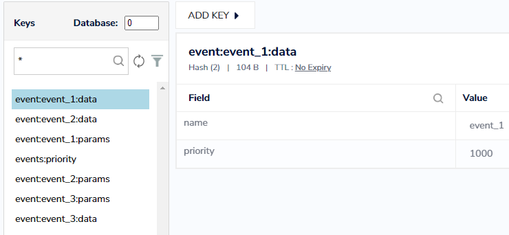
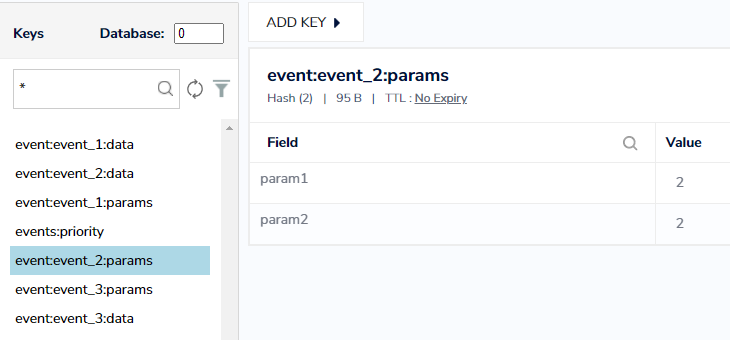
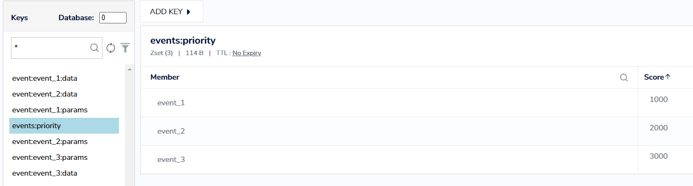

# PHP2021 HW-12 (Redis)

### Консольные команды для тестирования:

- Добавление информации о событии: php index.php create event_1 1000 param1=1,param2=2
- Удаление событий: php index.php clear
- Вызов события по параметрам: php index.php trigger param1=1,param2=2

### Структура таблицы в Redis:

