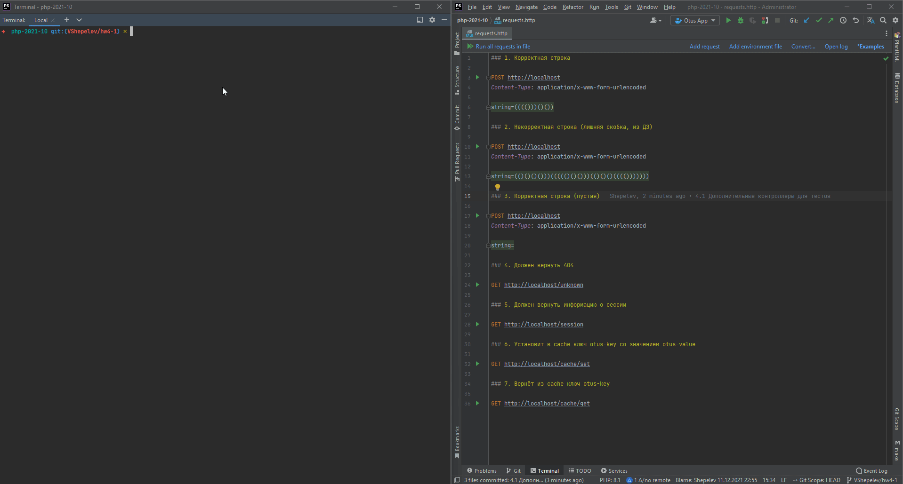
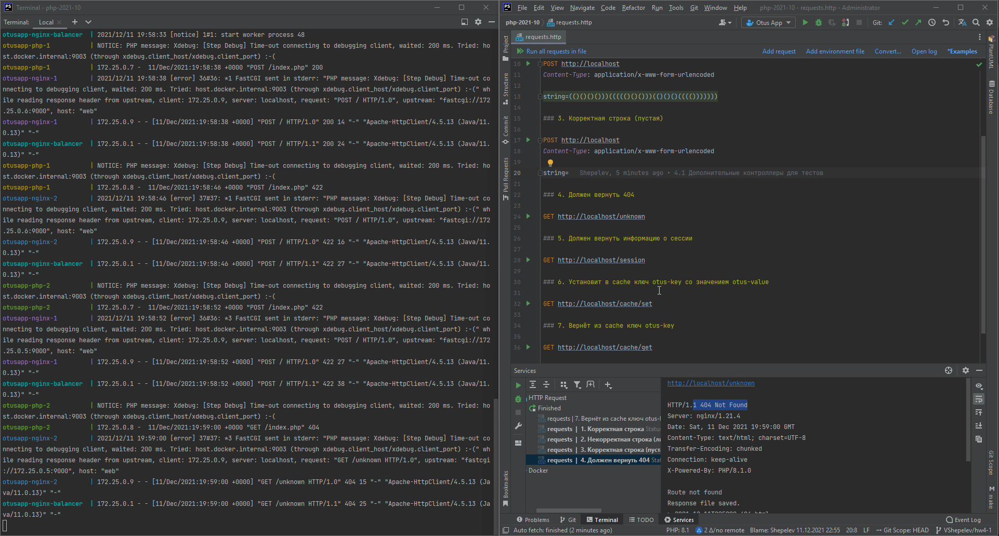
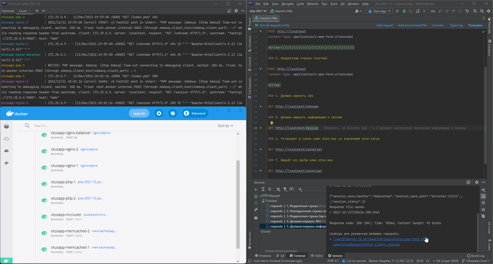

# PHP2021

## Домашнее задание №4

### Работа с инфраструктурой

1. Создайте `.env` с помощью команды `make create-env`
2. Отредактируйте `.env` как вам нужно.
4. Разверните инфраструктуру с помощью команды `make up`.
   1. В случае если вы хотите в терминале видеть логи контейнеров, используйте команду `make up-top`
5. Проверка программы.
6. Проверка инфраструктуры.
7. Чтобы остановить контейнеры и удалить всю развёрнутую инфраструктуру используйте команду `make down`
8. Отдельно удалите скачанные образы, если они не нужны: `make delete-base-images`

### Проверка строк

В корне проекта, есть файл [requests.http](./requests.http) - это файл для HTTP-клиента встроенного в PhpStorm. Запросы в нём пронумерованы, можете выполнять их прямо в тут, либо используя удобный вам HTTP-клиент. Для проверки первой части ДЗ можно выполнить следующие запросы:
1. Запрос с корректной строкой, должен вернуть 200.
2. Запрос с некорректной строкой (лишняя скобка), должен вернуть 422.
3. Запрос с пустой строкой, должен вернуть 422.
4. Запрос на неизвестный маршрут, должен вернуть 404. Для теста роутинга.

### Проверка инфраструктуры

Реализована инфраструктура со следующими особенностям:
1. Балансировщик на основе nginx `balancer`, слушающий 80 порт и распределяющий запросы на два веб-сервера: `webserver-1` и `webserver-2`.
2. Оба веб-сервера распределяют обработку динамики на два php-fpm инстанса: `backend-1` и `backend-2`.
3. Оба php-fpm инстанса работают с сессией через единый memcache-кластер `mcrouter` реализованный на основе [McRoute](https://github.com/facebook/mcrouter)
4. memcache-кластер обслуживает два memcached-сервера, реплицируя ключи на них обоих. Если остановить один из двух контейнеров с memcached, то приложение продолжит работу и будет читать и получать ключи со второго.

Чтобы проверить, что сессии работают с memcache-кластером, можно выполнить запрос #5. Он вернёт информацию о настройке сессии в php.ini, а также статус текущей сессии.

Чтобы проверить работу репликации, можно воспользоваться запросами #6 и #7:
1. После запуска всех контейнеров выполните запрос #6, он установит в memcache ключ и значение.
2. Выполните запрос #7, чтобы убедиться, что значение в кеше есть.
3. Удобным вам способом остановите один из контейнеров с memcached.
4. Повторите запрос #7. Значение также будет возвращаться.

