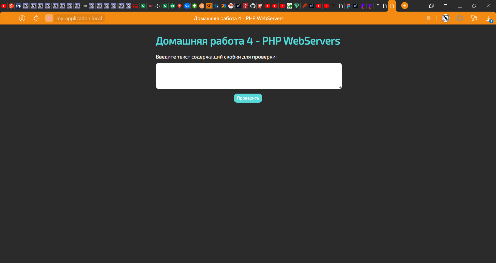
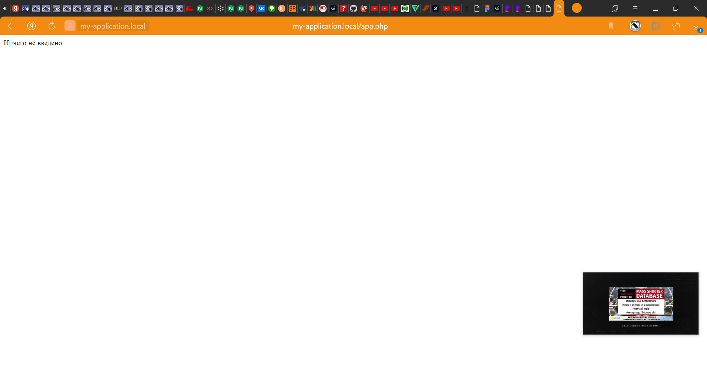
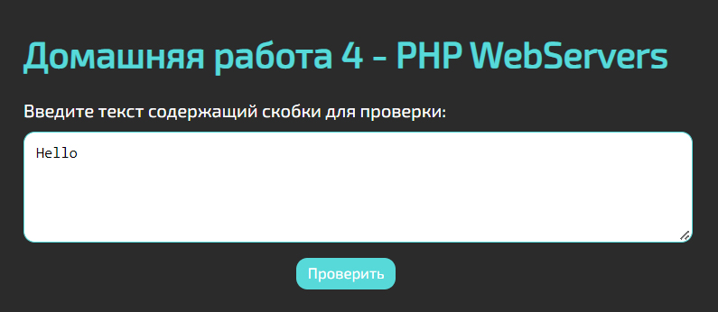
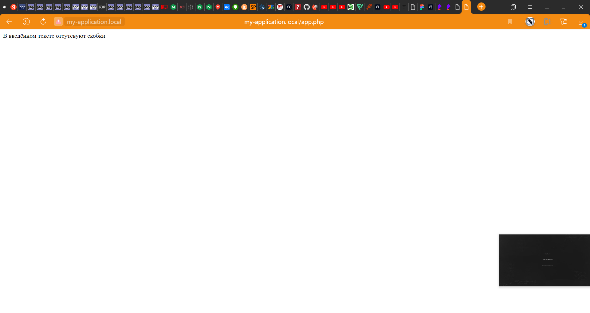
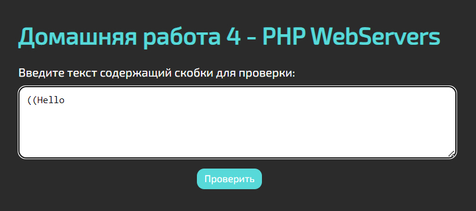
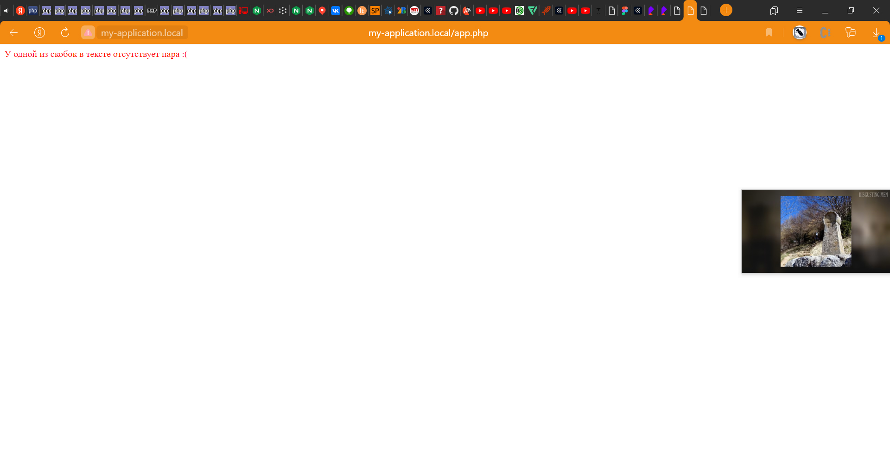
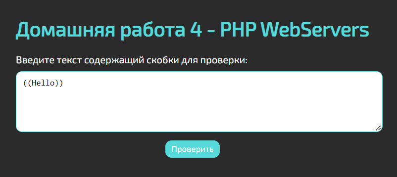
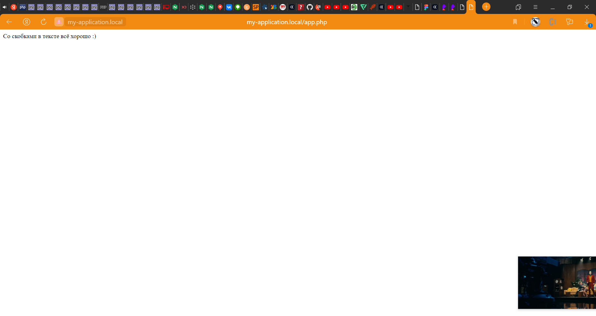

# Домашняя работа №4 - PHP WebServers

## Выполнил: Мелёшкин В.В.

### Инструкция:

Приложение предназначено для проверки парности скобок в скобок в 
введённом тексте. Интерефейс приложения крайне прост и состоит из
поля для ввода текста и кнопки запуска проверки:

Если попытаться оставить поле не заполненым, приложение выведет 
следущее сообщение об ошибке:

Если ввести текст в котором в принципе отсутсвуют скобки:

Приложение выведете следущее сообщение:

Если в тексте будут присутсвовать скобки без пары:

Приложение выдаст следущее сообщение об ошибке:

Если со скобками в тексте всё хорошо:

Приложение подтвердит что со скобками в тексте всё в порядке:

