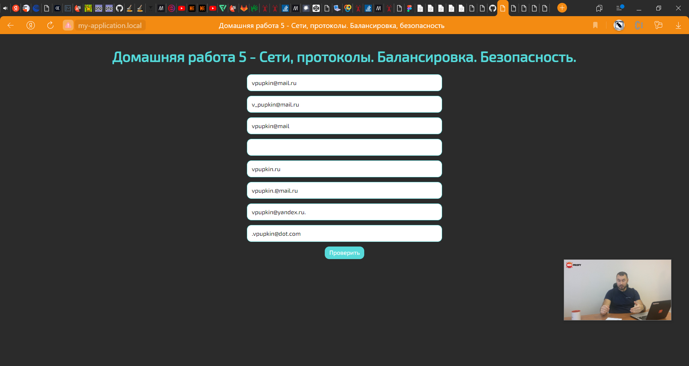
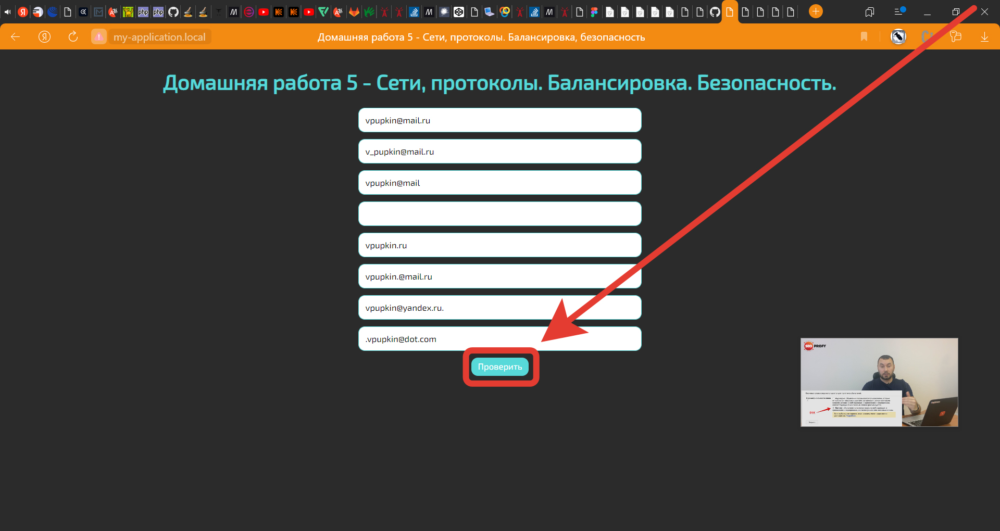
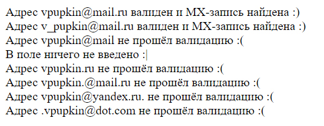

# Домашняя работа №5 - Сети, простоколы. Балансировка. Безопасность

## Выполнил: Мелёшкин В.В.

### Интсрукция:

Данное приложение предназначено для e-mail валидации. Оно имеет крайне простой интерфес,
состоящий из нескольких полей в которые заполнены заведомо валидными и невалидными адресами
электронной почты:

Изменить списко электронных адресов для проверки можно отредактировав массив `$arEmails`
в файле `emails.php` или заполнив самостолятельно одно или несколько сгенерированных полей.

После того как все поля будут заполнены электронными адресами подлежащими валидации,
следует нажать на кнопку проверить:

После этого откроется вкладка с результатами валидации:

