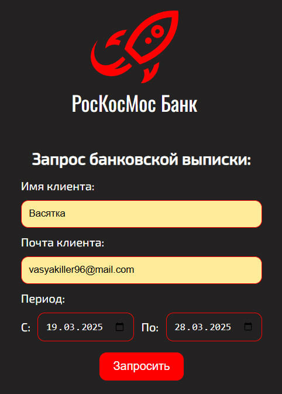
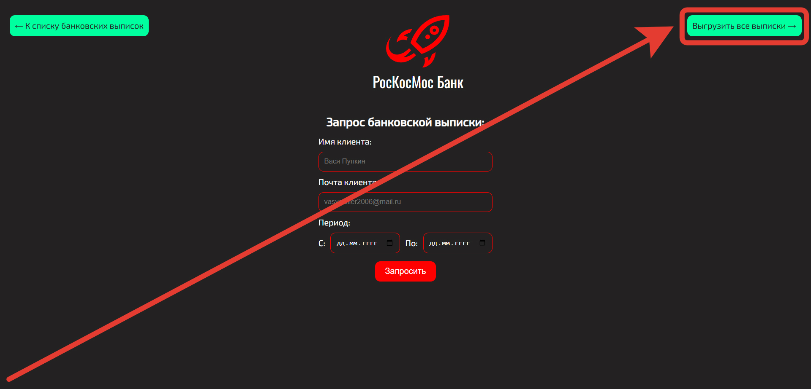
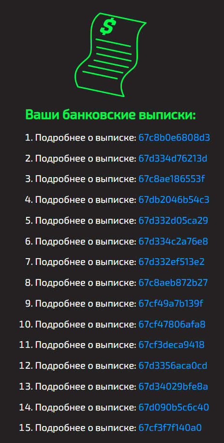
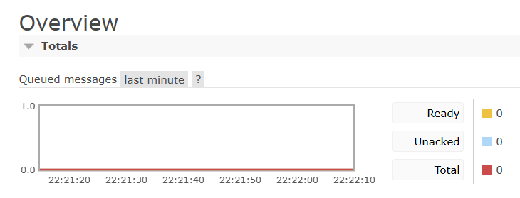

## Домашняя работа № 17 - Реализация Rest API с использованием очередей

## Выполнил: Мелёшкин В.В.

В данной домашней работе была реализована небольшая `REST API`, которая имитирует работу с банковскими выписками. Она
позволяет:

1. Добавлять запрос на банковскую выписку в очередь `RabbitMQ`, через интерфейс `/api/v1/statement`, а также записывать
   их в хранилище в качестве которого используется `Redis`;
2. Получать данные о банковской выписке, хранимом в `Redis`, по его `ID`, при помощи интерфейса
   `api/v1/statement/{messageId}`;
3. Выгружать данные о всех банковских выписках из очереди, брокера сообщений `RabbitMQ`, при помощи интерфейса
   `/api/v1/get-all-statements`.

### Графический интерфейс

Для удобной демонстрации разработанной `API`, я создал интерфейс состоящий из нескольких страниц и форм.

#### Добавление запроса на банковскую в очередь

Форма для создания и добавления заявок на банковскую выписку в очередь, расположена по адресу:
`http://my-application.local/requests.php`. Форма отправит `POST`-запрос в интерфейс `/api/v1/statement`:


Если сообщение будет успешно добавлено в очередь, то `API` вернёт следующий ответ в формате `JSON`:

```json
{
  "status": "success",
  "info": "Request accepted",
  "stm_id": "67db24a93b0c2",
  "stm_status": "running"
}
```

#### Получение информации о сообщении по его ID

Для того чтобы получить информацию о заявке на банковскую выписку, в очереди и её текущем статусе, нужно перейти на
страницу где будет выведен список всех отправленных заявок. Перейти на неё можно по ссылке которая расположена на
странице с формой для создания запроса на банковскую выписку:


После перехода по ссылке загрузится страница со списком всех запросов на банковские выписки и их идентификаторов:

Каждый элемент этого списка имеет ссылку, которая позволяет отправить `GET`-запрос в `API` и получить данные о выписке
по её ID. Перейдите по одной из ссылке, тем самым отправив `GET`-запрос в интерфейс `api/v1/statement/{messageId}` и
получите эти данные в формате `JSON`:

```json
{
  "status": "success",
  "info": "Statement found",
  "stm_id": "67cf4796ec202",
  "stm_status": "running"
}
```

#### Выгрузка всех сообщений из очереди

Для того чтобы выгрузить все сообщения которые в данный момент находятся в очереди, достаточно перейти по ссылке на
странице с формой:


После перехода по этой ссылке, будет отправлен `GET`-запрос в интерфейс `/api/v1/get-all-statements`, в ответ получим
информацию о всех запросах на банковские выписки, в формате `JSON`, которые находились в до этого момента в очереди:

```json
[
  {
    "client_name": "\u0412\u0430\u0441\u044f\u0442\u043a\u0430",
    "email": "vasyakiller96@mail.com",
    "date_from": "2025-03-21",
    "date_to": "2025-03-28",
    "request_type": "request"
  },
  {
    "client_name": "\u0412\u0430\u0441\u044f\u0442\u043a\u0430",
    "email": "vasyakiller96@mail.com",
    "date_from": "2025-03-21",
    "date_to": "2025-03-30",
    "request_type": "request"
  },
  {
    "client_name": "\u0412\u0430\u0441\u044f\u0442\u043a\u0430",
    "email": "vasyakiller96@mail.com",
    "date_from": "2025-03-22",
    "date_to": "2025-03-28",
    "request_type": "request"
  },
  {
    "client_name": "\u0412\u0430\u0441\u044f",
    "email": "vasatkapupkin@mail.com",
    "date_from": "2025-03-22",
    "date_to": "2025-03-26",
    "request_type": "request"
  }
]
```

Очередь после этого опустеет:
