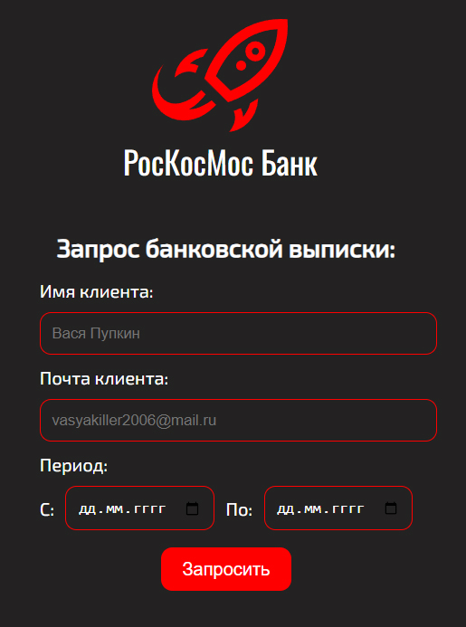
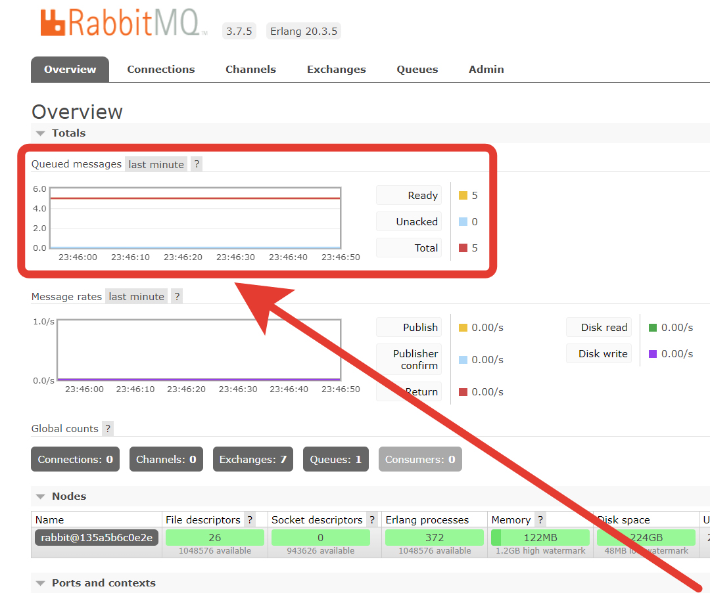
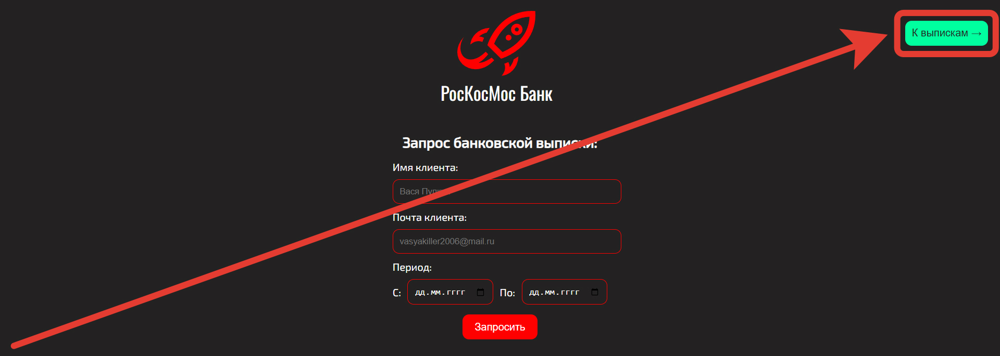
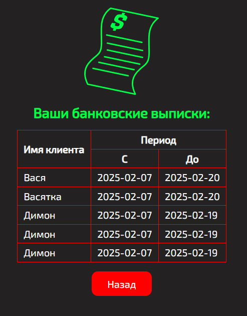
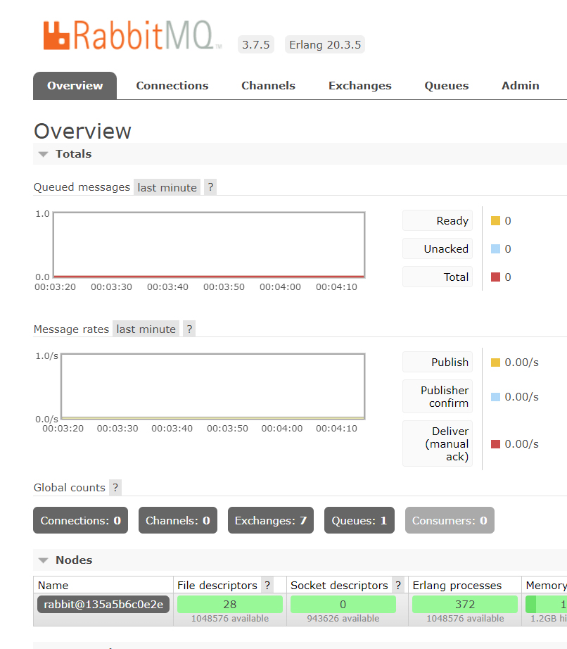

## Домашняя работа № 16 - Очереди

## Выполнил: Мелёшкин В.В.

### Создание сообщения в очереди RabbitMQ

Создать сообщение очень просто. Для этого нужно перейти на главную страницу приложения и заполнить форму размещённую
там:



После заполнения и отправки формы, будет показано страница уведомляющая об успехе данной операции:


В случае если при создании запроса возникнут проблемы будет выведено сообщение об ошибке:


После этого все созданные запросы, можно будет увидеть в административной панели `RabbitMQ Management`, которая работает
на порте `15672`:



### Получение запросов из очереди RabbitMQ

Получить запросы из очереди `RabbitMQ` можно 2 способами:

1. Через веб интерфейс;
2. Через консольный скрипт на `PHP`.

Для этого было реализовано 2 класса:

1. `ConsumerWeb` - для работа в веб версии;
2. `ConsumerConsole` - для консольной версии.

Оба класса являются наследниками суперкласса `Consumer`.

#### Веб версия

И так, для запуска веб версии консьюмера достаточно просто перейти по ссылке в правом верхнем углу, главной страницы:



Посде этого из `RabbitMQ`, загрузятся банковские выписки которые были созданы ранее:



Также скрипт отправит уведомления на все указанные, ранее в формы адреса электронных почт.
После этого очередь в `RabbitMQ` опустеет, в чём можно убедиться в административной панели `RabbitMQ Management`:



#### Консольная версия

Для того чтобы получить запросы на банковскую выписку через консоль, нужно подключиться по `SSH`, к контейнеру с
веб-сервером и там запустить скрипт `consume.php`:

```shell
php consume.php
```

После чего скрипт начнёт работу и в консоль начнут выводиться сообщения, об успешной отправки уведомлений на почту
клиентов, с информацией о том что их запрос на банковскую выписку готов. Сообщения будут продолжать выводиться до тех
пор пока очередь `RabbitMQ`, не опустеет.