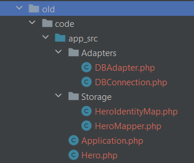
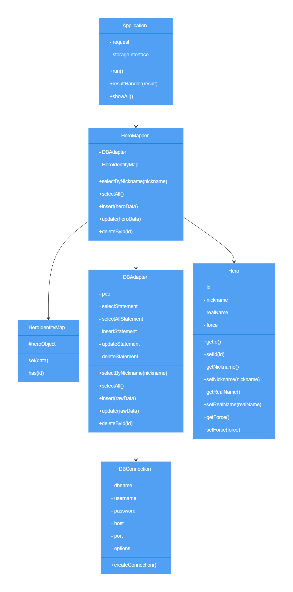
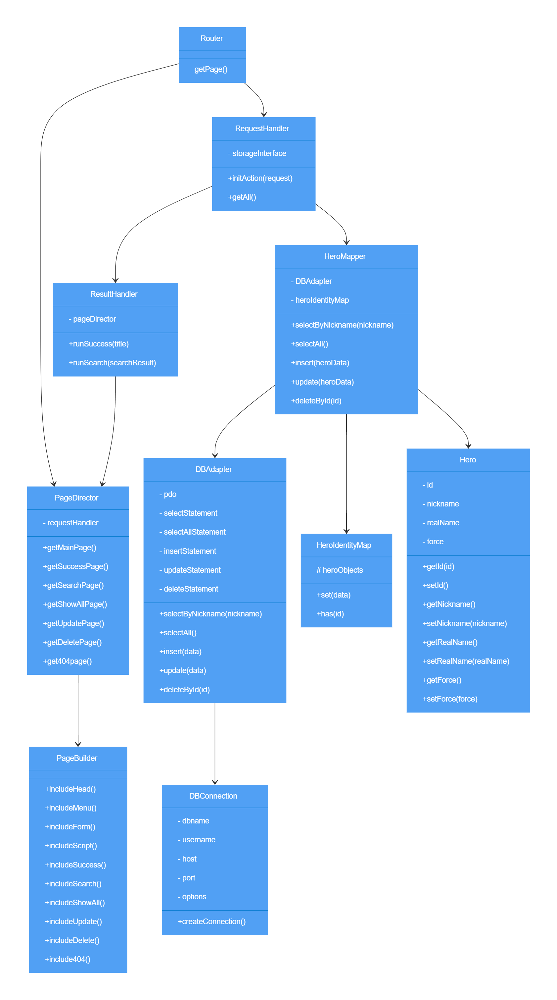

# Домашняя работа №13 - Архитектура кода

## Выполнил: Мелёшкин В.В.

В ходе выполнения данной домашней работы был проведён глубокий рефакторинг приложения из предыдущей домашней работы
курса **PHP и базы данных**. Были реализованы следущие модификации кода:

1. Архитектуар кода была разделена на 4-ре уровня:
    1. Presentation;
    2. Application;
    3. Domain;
    4. Infrastructure.
       До рефакторинга никакого деления приложения на уровни небыло и код представлял собой разрозненные классы
       сгрупированные
       по функциональному признаку:



2. Был создан роутинг, позволивший внедрить в приложение ЧПУ автоматически подключающий нужный файл старницы. До этого
   ссылки в главном меню указывали на конкретные файлы:

```html

<menu>
    <li class="button_active menu-button" data-action="add">Добавить</li>
    <li class="menu-button" data-action="search">Найти</li>
    <a class="menu-button" href="/pages/show_all.php">Показать всех</a>
    <a class="menu-button" href="/pages/update.php">Обновить</a>
    <a class="menu-button" href="pages/delete.php" data-action="delete">Удалить</a>
</menu>
```

Теперь кнопки в меню ссылаются на ЧПУ:

```html

<menu>
    <li class="button_active menu-button" data-action="add">Добавить</li>
    <li class="menu-button" data-action="search">Найти</li>
    <a class="menu-button" href="/show_all/">Показать всех</a>
    <a class="menu-button" href="/update/">Обновить</a>
    <a class="menu-button" href="/delete/" data-action="delete">Удалить</a>
</menu>
```

Всё остальное делает класс роутер. А если он не сможет найти подходящий файл страницы то выдаст 404-ю:


3. Для сборки страниц был реализован паттерн **Строитель**, состоящий из двух классов:
    1. `PageBuilder` - класс сборщик страниц;
    2. `PageDirector` - класс управляющий сборкой страницы.
       Ранее части необходимые для сборки страницы подключались напрямаю в через `requer_once`:

```php
<?php require_once('../vendor/autoload.php');

$app = new Application();
$heroes = $app->showAll();
$title = 'Обновить'; ?>
<!doctype html>
<?php require_once '../parts/head.php' ?>
<body>
<main>
    <div class="wrapper">
        <svg class="icon" viewBox="0 0 111 134" fill="none" xmlns="http://www.w3.org/2000/svg">
            <path d="M57.7644 72.7614C64.1913 72.4152 73.6041 70.595 80.9634 66.4633C86.3025 58.2111 89.8323 51.4775 93.3066 44.1298C88.5336 44.4871 83.028 44.0795 78.1218 42.6948C84.0492 41.6731 91.4862 39.5402 97.1139 35.9055C104.079 25.9447 109.241 9.89244 111 0.00984633C95.0493 -0.258156 80.1087 4.97906 70.0077 11.534C66.6 15.4423 63.6474 24.8727 62.9481 29.8642C61.4108 26.2574 60.2897 20.4841 61.605 15.6713C53.5131 19.9537 46.4369 24.8448 38.4227 31.6397C34.4267 40.1712 33.7939 50.0091 34.1602 55.5143C31.9902 52.4267 29.082 46.4134 29.4872 39.8306C15.1127 53.8114 5.1948 72.1249 14.6021 91.8901C25.0305 81.0527 37.0185 70.7681 44.3167 65.9887C27.4669 85.3854 11.7605 110.918 0 134L13.8972 129.611C19.9134 118.562 25.3246 109.042 30.1753 102.225C48.0963 104.587 64.0082 90.1202 74.7308 75.4526C70.4573 76.5134 62.2655 75.1288 57.7644 72.7614Z"
                  fill="#1DF576"/>
        </svg>
        <h1 class="success_title">Внесите изменения в базу:</h1>
        <?php foreach ($heroes as $hero) { ?>
            <form class="update-form" action="../app.php" method="post">
                <div class="update-form__block">
                    <label for="nickname">Псевдоним:</label>
                    <input class="update-form__input"
                           id="nickname"
                           name="nickname"
                           type="text"
                           value="<?php echo $hero->getNickname() ?>">
                </div>
                <div class="update-form__block">
                    <label for="real_name">Настоящее имя:</label>
                    <input class="update-form__input"
                           id="real_name"
                           name="real_name"
                           type="text"
                           value="<?php echo $hero->getRealName() ?>">
                </div>
                <div class="update-form__block">
                    <label for="super_force">Супер-сила:</label>
                    <input class="update-form__input"
                           id="super_force"
                           name="super_force"
                           type="text"
                           value="<?php echo $hero->getForce() ?>">
                </div>
                <input type="hidden" name="id" value="<?php echo $hero->getId() ?>">
                <input id="action" type="hidden" name="action" value="update">
                <input class="button" type="submit" value="Сохранить">
            </form>
        <?php } ?>
        <a href="/" class="button button-update">Назад</a>
    </div>
</main>
</body>
</html>
```

Теперь-же достаточно просто вызвать нужный метод класса управляющего сборкой страниц:

```php
use Presentation\PageBuilder;
use Presentation\PageDirector;

$pageBuilder = new PageBuilder();
$pageDirector = new PageDirector($pageBuilder);

$pageDirector->getShowAllPage();
```

4. Ранее класс `Application` нарушал **Принцип единой отвественности**, так как одновременно:
    1. Инициализировал работу приложения;
    2. Обрабатывал запросы;
    3. Обарбатывал результаты выполнения запросов;
       В ходе рефакторинга он был разделён на 2 класса:
    1. `RequestHandler` - обработчик запросов;
    2. `ResultHandler` - обработчик результатов запроса.
       А за инициализацию приложения теперь по сути отвечает класс роутер.
5. Для согласования уровней приложения между собой были добавлены интерфейсы. В старом приложении интерфесы отсутвовали
   в принципе.
6. Некоторые связи между классами были раелаизованы в качестве зависимостей. Было:

```php
   public function __construct()
    {
        $this->request = $_POST;
        $dbConnections = new DBConnection();
        $DBAdapter = new DBAdapter($dbConnections);
        $this->storageInterface = new HeroMapper($DBAdapter);
    }
```

Стало:

```php
   public function __construct(StorageAdapter $DBAdapter)
    {
        $this->storageInterface = new HeroMapper($DBAdapter);
    }
```

При чём зависимость возникает не от класса, а от интерфейса.

UML-диаграмма до рефакторинга:

UML-диаграмма полсле рефакторинга:
