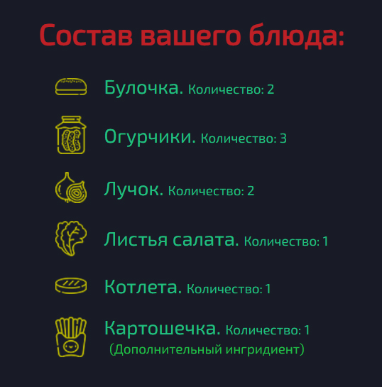

# Домашняя работа №14 - Design patterns

## Выполнил: Мелёшкин В.В.

В ходе данной домашней работы было реализовано приложение для заказа еды в ресторане общественного питания. В данном
приложении используются паттерны:

* Адаптер;
* Декоратор;
* Фабрика;
* Наблюдатель;
* Стратегия.

## Инструкция

### Добавление

Для заказа еды нужно заполнить форму, для этого:

1. Ввести адрес электронной почты на которую будут приходить уведомления о статусе заказа;
2. Выбрать одно из блюд из выпадающего списка;
3. Выбрать или нет, один из нескольких дополнительных ингредиентов.
4. Нажать на кнопку **Заказать!**

После этого загрузится страница на которой будут перечислены ингредиенты выбранного блюд:

Так-же в ходе работы приложения на указанный e-mail будут отправляться письма, о статусе заказа.