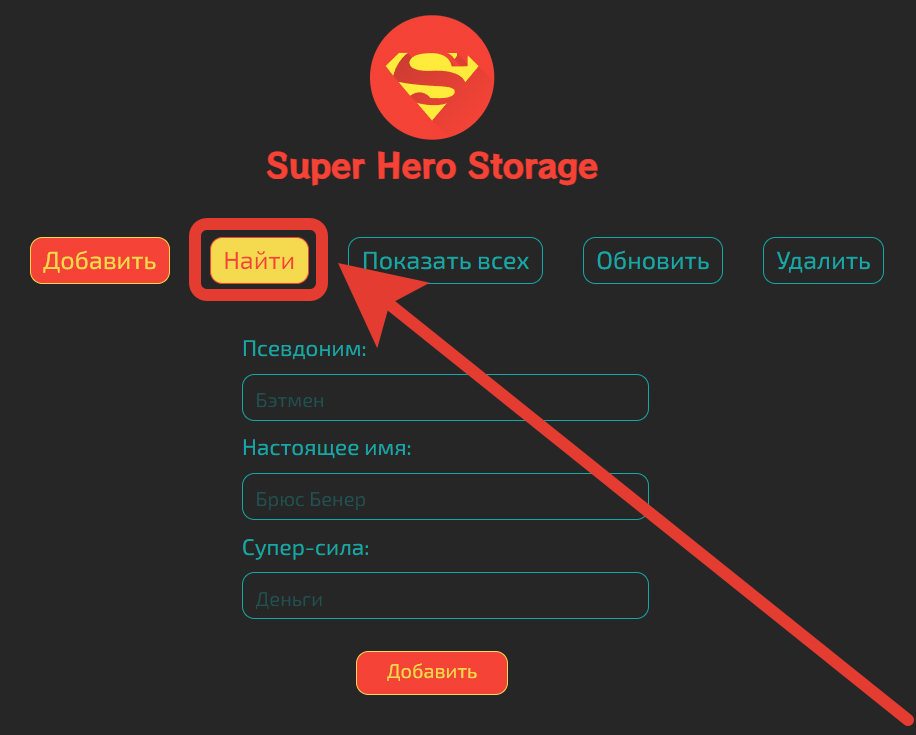

# Домашняя работа №11 - Redis

## Выполнил: Мелёшкин В.В.

В ходе выполнения данной домашней работы было реализовано приложение для хранения событий. Данные можно сохранить либо в
СУБД **Redis**, либо в поисковом движке **ElasticSearch**.

### Инструкция

#### Добавление

Для того чтобы сохранить данные в приложении, нужно кликнуть по кнопке **Добавить** в верхней панели приложения
(открывается по умолчанию):

В выпадающем списке **Хранилище**:

Можно выбрать в какое хранилище будут записаны данные (Redis или ElasticSearch). Далее нужно заполнить все поля и
нажать на кнопку **Выполнить**:

После чего появится сообщение об успешном добавление данных:

#### Поик

Чтобы воспользоваться поиском нужно кликнуть по кнопке **Найти**:

Поиск осуществляется по **Условию возникновения**:

После заполнения данного поля нужно нажать на кнопку **Выполнить** чтобы отправить запрос на поиск. После чего
загрузится страница с результатами поиска. На странице результатов отображается данные о одном событии, самым высоким
приоритетом:

#### Удаление

Чтобы удалить все данные из хранилища, нужно кликнуть по кнопке **Удалить всё**:

После чего откроется форма удаления, на которой нужно будет выбрать хранилище, которое требуется очистить и нажать на
кнопку выполнить:

После этого появится сообщение об успешном удалении данных:

