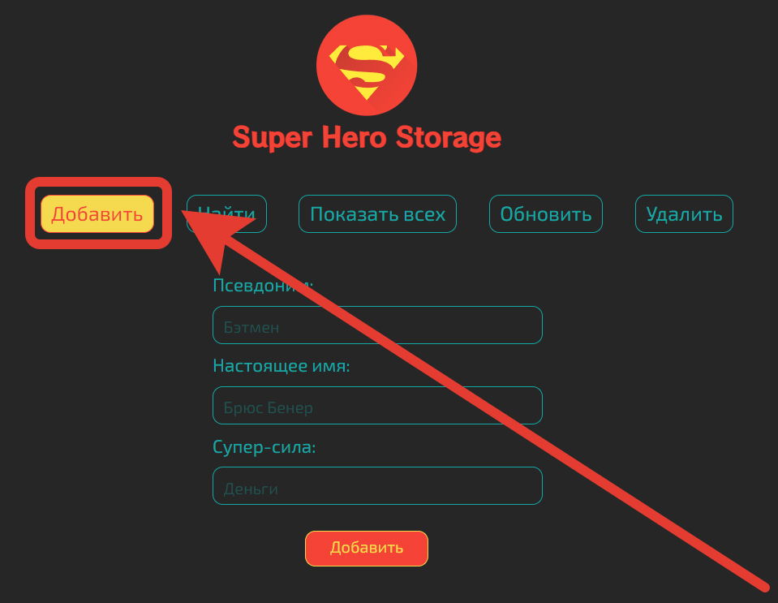
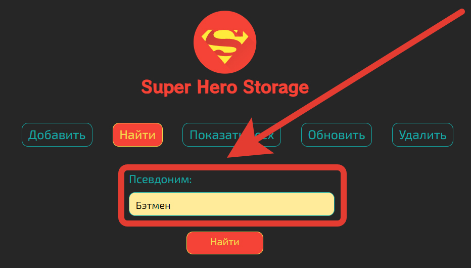
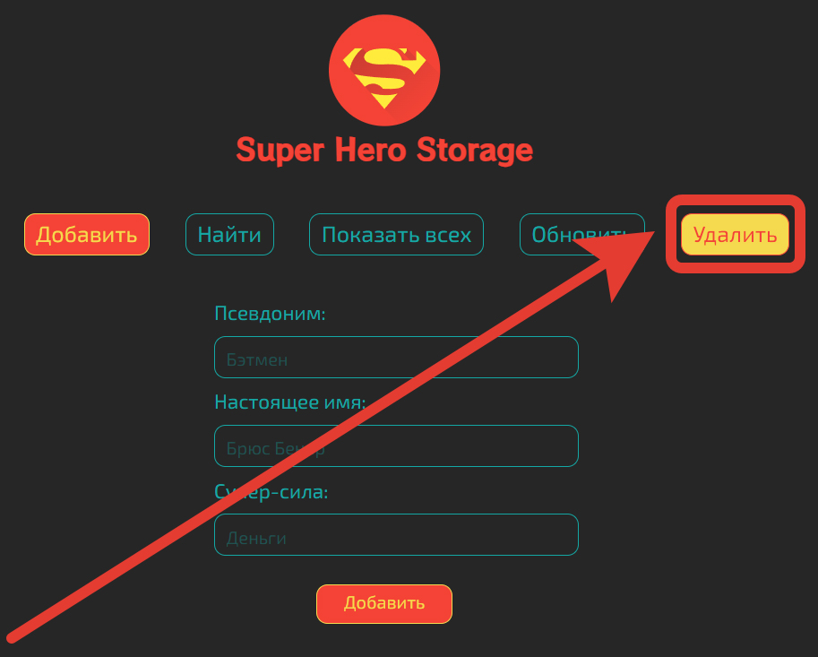

# Домашняя работа №12 - PHP и базы данных

## Выполнил: Мелёшкин В.В.

В ходе выполнения данной домашней работы был реализован паттерны `DataMapper` и `Identity Map` в рамках небольшого
приложения для работы с базой данных.

## Инструкция

### Добавление

Для того чтобы сохранить данные в приложении, нужно кликнуть по кнопке **Добавить** (открывается по умолчанию) в верхней
панели приложения:

Для добавления данных нужно заполнить форму и нажать кнопку **Добавить**:

В случае успешного добавления будет показано соответствующее сообщение:

### Поиск

Чтобы воспользоваться поиском нужно кликнуть по кнопке **Найти**:

Поиск осуществляется по псевдониму супергероя:

После заполнения поля с ником, приложение выполнит поиск и покажет найденные данные в виде таблицы:

### Показать всех

Чтобы увидеть всех супергероев хранящихся в базе нужно перейти по ссылке **Показать всех**:

После чего приложение загрузит страницу на которой будут отображены данные о всех имеющихся в базе супергероях в виде
таблицы:

После этого появится сообщение об успешном удалении данных:

### Обновить

Для редактирования данных в базе нужно кликнуть по кнопке **Обновить** в верхнем меню:

После чего приложение загрузит страницу, на которой в формах будут представлены данные о всех имеющихся в базе
супергероях:

Для изменения данных достаточно отредактировать одно из полей и нажать по кнопке сохранить на против него:

После успешного сохранения данных приложение покажет соответствующее сообщение:

### Удаление

Для удаления данных нужно перейти по ссылке **Удалить** в верхнем меню:

После чего откроется все данные о супергероях в базе,  доступные к обновлению:

Для удаления данных достаточно кликнуть по крестику напротив соответствующих данных, после чего приложение их удалить и
и покажет соответствующее сообщение:

