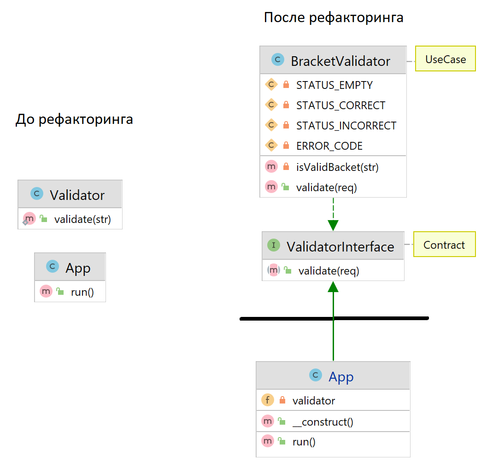

# PHP2021

### Рефакторинг браузерного приложения для верификации скобок

До рефакторинга большая часть логики верификации строки была в App. В валидаторе
осуществлялась лишь проверка правильности скобок. Отсутствовали абстракции.

После рефакторинга App использует подменяемый и независимый от реализации
интерфейс валидации (реализована инъекция зависимостей при помощи DI-контейнера)
. Request и Response выделены в отельные классы и стандартизованы. В
BracketValidator вынесена конкретная реализация верификации строки со скобками.

### UML диаграммы до и после рефаткоринга

