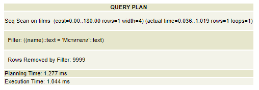
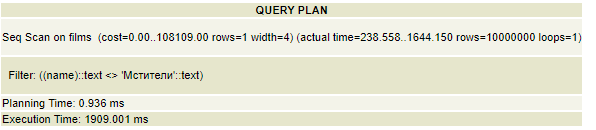
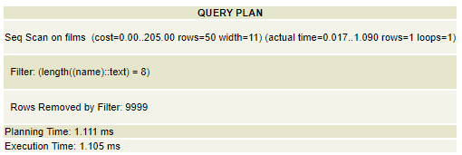
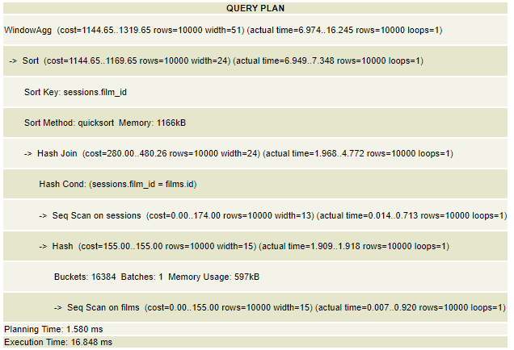
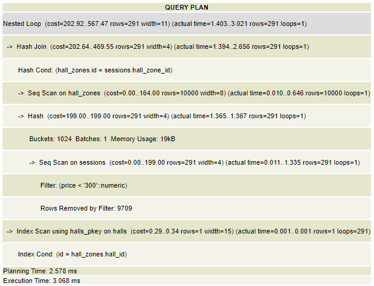
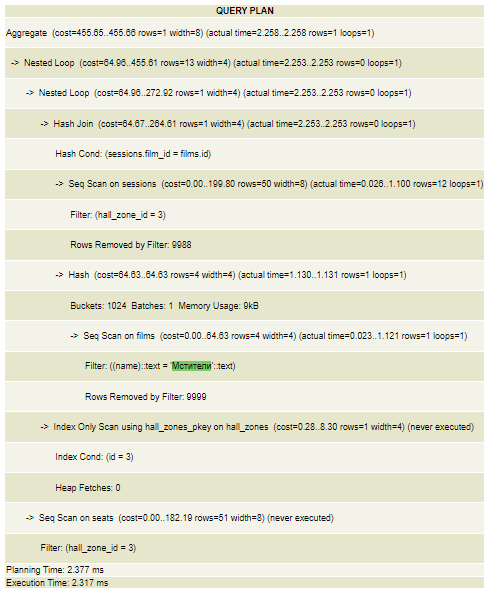

### 1. Получение всех фильмов, которые не является фильмом "Мстители"
#### запрос
```
EXPLAIN ANALYZE
SELECT id FROM films WHERE name != 'Мстители';
```

#### план на БД до 10000 строк


#### план на БД до 10000000 строк


#### перечень оптимизаций с пояснениями
```
ALTER TABLE `films` ADD INDEX(`name`);
```
Добавление индекса лишь уменьшило стоимость запроса и он был выполнен на 100 мсекунд быстрее

### 2. Получение цены сеансов, которые стоят дешевле 300
#### запрос
```
EXPLAIN ANALYZE
SELECT price FROM sessions WHERE price < 300 ORDER BY price;
```

#### план на БД до 10000000 строк


#### перечень оптимизаций с пояснениями
```
ALTER TABLE `films` ADD INDEX(`price`);
```
Добавление 

### 3. Получение времени в сеансах дороже 300 рублей
#### запрос
```
EXPLAIN ANALYZE 
SELECT time FROM sessions WHERE price > 300;
```

#### план на БД до 10000 строк


### 4. Получение сессий с суммарной ценой фильма за все сессии
#### запрос
```
EXPLAIN ANALYZE 
SELECT sessions.id, films.name, sum(price) OVER w
FROM films JOIN sessions ON sessions.film_id = films.id
    WINDOW w AS (PARTITION BY film_id);
```

#### план на БД до 10000 строк


### 5. Получение залов, в которых сессии не дороже 300 рублей
#### запрос
```
EXPLAIN ANALYZE 
SELECT halls.name FROM sessions
    JOIN hall_zones on sessions.hall_zone_id = hall_zones.id
    JOIN halls on halls.id = hall_zones.hall_id
    WHERE price < 300
```

#### план на БД до 10000 строк


### 5. Получение кол-ва сессий, в которых показывают не фильм "Мстители"
#### запрос
```
EXPLAIN ANALYZE 
SELECT COUNT(sessions.id) FROM sessions
    JOIN films ON sessions.film_id = films.id
WHERE films.name != 'Мстители'
```

#### план на БД до 10000 строк

