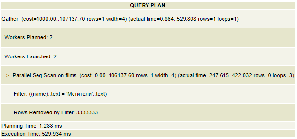
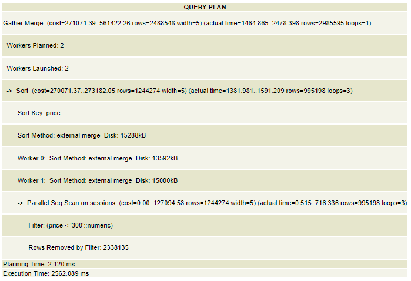

### 1. Получение фильма "Мстители"
#### запрос
```
EXPLAIN ANALYZE
SELECT id FROM films WHERE name = 'Мстители';
```

#### план на БД до 10000 строк


#### план на БД до 10000000 строк


#### перечень оптимизаций
```
CREATE INDEX name ON public.films USING btree (name);
```
Добавление индекса значительно ускорило выполнение запроса,
тк мы получили указатель на строку таблицы, не просматривая таблицу


### 2. Получение цены сеансов, которые стоят дешевле 300
#### запрос
```
EXPLAIN ANALYZE
SELECT price FROM sessions WHERE price < 300 ORDER BY price;
```

#### план на БД до 10000 строк


#### план на БД до 10000000 строк


#### перечень оптимизаций
```
CREATE INDEX cheap_price ON public.sessions USING btree (price)
WHERE price > 300;
```
Добавление фильтрованного индекса позволило получить сразу из индекса список
всех сеансов дешевле 300 и сократить время получения ответа

### 3. Получение названий фильмов с названием длиной в 8 символов
#### запрос
```
EXPLAIN ANALYZE 
SELECT name FROM films WHERE length(name) = 8;
```

#### план на БД до 10000 строк


#### план на БД до 10000000 строк


#### перечень оптимизаций
```
CREATE INDEX name_len ON public.films USING btree (length(name)) INCLUDE (name);
```
Использование покрывающего функционального индекса позволило нам получить ответ на
запрос прямо из таблицы индексов, что позволило ускорить запрос

### 4. Получение сессий с суммарной ценой фильма за все сессии
#### запрос
```
EXPLAIN ANALYZE 
SELECT sessions.id, films.name, sum(price) OVER w
FROM films JOIN sessions ON sessions.film_id = films.id
    WINDOW w AS (PARTITION BY film_id);
```

#### план на БД до 10000 строк


#### план на БД до 10000000 строк


#### перечень оптимизаций
```
CREATE INDEX film_id ON public.sessions USING btree (film_id);
CREATE INDEX id ON public.films USING btree (id);
```
Добавление индексов для внешнего ключа и ключа для id внешней таблицы 
позволило ускорить запрос, тк эти аттрибуты теперь беруться из таблицы индексов


### 5. Получение залов, в которых сессии не дороже 300 рублей
#### запрос
```
EXPLAIN ANALYZE 
SELECT halls.name FROM sessions
    JOIN hall_zones on sessions.hall_zone_id = hall_zones.id
    JOIN halls on halls.id = hall_zones.hall_id
    WHERE price < 300
```
#### перечень оптимизаций
```
CREATE INDEX cheap_price ON public.sessions USING btree (price)
WHERE price < 300;
```
Добавление фильтрованного индекса позволило получить сразу из индекса список
всех сеансов дешевле 300 и сократить время получения ответа

#### план на БД до 10000 строк


#### план на БД до 10000000 строк


### 6. Получение кол-ва мест в зонах залов, в которых показывают не фильм "Мстители"
#### запрос
```
EXPLAIN ANALYZE 
SELECT COUNT(seats.id) FROM seats
    JOIN hall_zones on seats.hall_zone_id = hall_zones.id
    JOIN sessions on sessions.hall_zone_id = hall_zones.id
    JOIN films ON sessions.film_id = films.id
WHERE films.name != 'Мстители' AND seats.hall_zone_id != 3
```

#### план на БД до 10000 строк


#### план на БД до 10000000 строк


#### перечень оптимизаций
```
CREATE INDEX name ON public.films USING btree (name);
CREATE INDEX seat_hall_zone_id ON public.seats USING btree (hall_zone_id);
```
Добавление индексов ускорило выполнение запросов